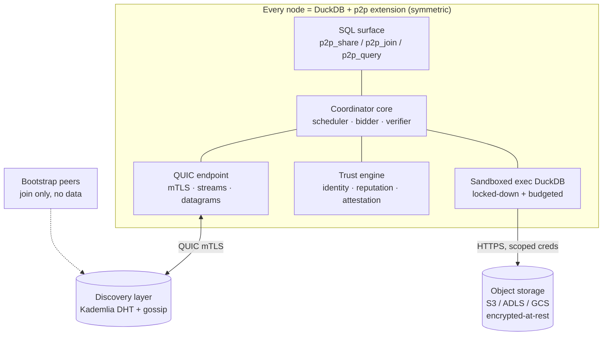
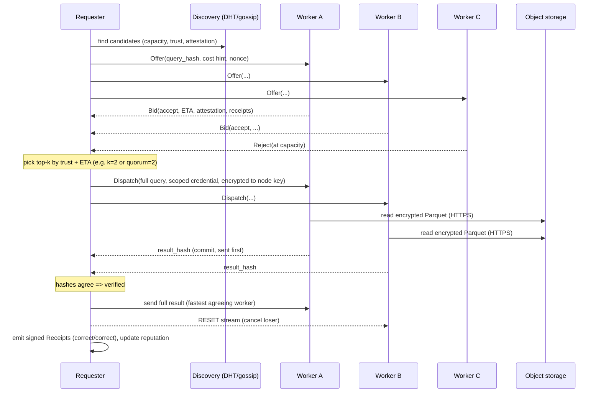

# Distributed P2P DuckDB over QUIC — Architecture & Trust Design

> Status: Design draft (v0.1)
> Scope: A peer-to-peer compute grid where independent machines ("hosts") donate
> RAM/CPU and run DuckDB queries on behalf of remote requesters, with **no central
> broker**, **end-to-end encrypted transport over QUIC**, and a concrete
> **trustworthiness mechanism** so a requester can reason about *which* untrusted
> hosts to trust with a job.

---

## 1. Goals & non-goals

### Goals
- Run on ordinary **local machines** (laptops/desktops) that each run DuckDB + this extension.
- A host advertises a **resource budget** (RAM, CPU/threads, max concurrent jobs) it is willing to share.
- A requester broadcasts a **query + scoped credentials** to many candidate hosts.
- Several hosts **accept**; the query runs redundantly; the **first correct result wins** ("hedged execution"), the rest are cancelled.
- **Direct peer-to-peer** communication over **QUIC** — no data-path middleman.
- A **trust model** that lets a requester decide which hosts are trustworthy enough for a given job, and detect/penalize cheaters.
- Data lives in **cloud object storage** (S3 / ADLS / GCS); hosts are pure compute.

### Non-goals (for the first milestones)
- A full distributed query optimizer / data-sharding scatter-gather engine (deferred — see Roadmap Phase 4).
- Guaranteeing a *malicious host operator cannot read plaintext on commodity laptops* — this is **physically impossible without confidential-computing hardware** (see §9.3). We instead **minimize blast radius** and route sensitive data only to attested hosts.

---

## 2. Terminology

| Term | Meaning |
|---|---|
| **Node** | A process running DuckDB + this extension. Every node is symmetric (can be client and server), like the Quack protocol. |
| **Requester** | A node that wants a query executed. |
| **Host / Worker** | A node that donates resources and executes queries for others. |
| **Job** | One query execution request, possibly dispatched redundantly to multiple workers. |
| **Bid** | A worker's offer to run a job (price/ETA + attestation evidence). |
| **Quorum** | The number of workers whose results must agree before a job is "verified". |
| **Receipt** | A signed statement about a completed job's outcome, used to build reputation. |
| **Trust score** | A requester-computable estimate of a worker's trustworthiness. |

---

## 3. System architecture



### Request lifecycle (happy path)



---

## 4. Data plane

- Data is **not** owned by hosts. Queries reference cloud object storage: `s3://…`, `az://…`/`abfss://…`, `gcs://…`, read via DuckDB's `httpfs`/`azure`/cloud secrets.
- Because every host sees identical input, **redundant execution and result-hash comparison work cleanly** (same input + same SQL ⇒ same canonical output).
- Data **at rest** should be **encrypted** (see §9.2, Parquet Modular Encryption) so the storage bytes are meaningless without the key, which is delivered per-job.

### 4.1 Data sources & formats (implemented)

Workers read cloud object storage through DuckDB's native extensions. Both the
**formats** and the **providers** are pluggable and fully configurable (no
hard-coding) under the `[storage]` config section.

| Concern | Supported | DuckDB mechanism |
|---|---|---|
| **Formats** | Parquet, CSV, JSON, Delta Lake, Apache Iceberg (extensible) | `parquet`, `json` (core/bundled), `delta`, `iceberg` extensions; CSV is core |
| **Providers** | AWS S3, **self-hosted MinIO / S3-compatible**, Azure ADLS (`abfss://`/`az://`), Google Cloud Storage, generic HTTPS, local | `httpfs`(+`aws`), `azure`, `httpfs`/`gcs` (S3-interop), `httpfs` |

**Self-hosted MinIO / S3-compatible endpoints.** The `s3` provider works against
any S3-compatible store, not just AWS. Per-provider options
(`[storage.provider_options.s3]`, layered under the top-level `[storage]`
defaults and `P2P_STORAGE_*` env) map to the DuckDB s3 secret: `endpoint`
(e.g. `minio.local:9000`), `url_style` (`path` for MinIO, `vhost` for AWS),
`use_ssl` (TLS on/off), and `region`. The worker mints
`CREATE SECRET (TYPE s3, KEY_ID …, SECRET …, ENDPOINT 'minio.local:9000',
URL_STYLE 'path', USE_SSL false, REGION …, SCOPE 's3://bucket/prefix/')` so
`s3://bucket/…` reads from MinIO (Delta needs the `delta` + `httpfs`
extensions). These options are **non-secret connection knobs only** — the access
key / secret are never stored in config; they arrive per job, encrypted (below).

**Pluggable abstraction** (`crates/node/src/datasource.rs`, mirrors the project's
trait pattern):
- `DataFormat` — a format plus the DuckDB extensions it requires.
- `StorageProvider` trait — turns a per-job `ScopedCredential` into a
  `CREATE SECRET` statement; impls `S3Provider`, `AzureProvider`, `GcsProvider`,
  `HttpsProvider`, `LocalFileProvider`. New clouds slot in behind the trait.
- `ProviderRegistry` / `StorageSetup` — resolved **once at engine init** from
  config (enabled providers + options, the explicit extension pre-load list,
  allowed local dirs, the remote-access switch). The untrusted query text never
  influences these.

**Secure-read boundary** (reconciling remote reads with the §9.4 lockdown). The
real engine sets up each fresh, per-job connection in a strict order *before*
the untrusted query runs:

1. budget (`memory_limit`/`threads`) + ephemeral `temp_directory`;
2. disable extension auto-install/auto-load + unsigned extensions;
3. `LOAD` the **pre-resolved** extension set (chosen at init from config — never
   `INSTALL`/`LOAD` at query time);
4. `SET allowed_directories=[…]` for any configured local fixtures (must precede
   locking external access);
5. per-job `add_parquet_key` (at-rest) + a **scoped, short-lived**
   `CREATE SECRET` (S3 STS session token / Azure user-delegation SAS / GCS
   downscoped/HMAC — never long-lived keys), scoped read-only to the object
   prefix;
6. `SET enable_external_access` — `true` **only** in the remote profile;
7. `SET lock_configuration=true` — the query can no longer widen anything.

**What DuckDB can vs. cannot restrict natively (honest):**
- **Local files — restrictable.** `allowed_directories`/`allowed_paths` give
  fine-grained control even with `enable_external_access=false`. The strict
  engine allows none; the local-scoped engine allows only the configured fixture
  dirs; `/etc/passwd` and friends stay blocked.
- **Network — all-or-nothing.** `enable_external_access` is a single global
  flag; DuckDB **cannot** restrict egress to specific storage endpoints. So the
  remote profile shrinks blast radius via **scoped, short-lived secrets** (a
  stolen credential reads only its prefix, read-only, for minutes) and relies on
  **OS-level egress filtering** to the configured endpoints as the complementary
  control. **That OS sandbox / egress filter is separately deferred (§9.4,
  §19)** — until it lands, a worker with remote access enabled can, in
  principle, reach arbitrary hosts and read local files, so enable remote access
  only on workers whose OS-level egress + filesystem are externally constrained.
- **At rest — supported.** Parquet Modular Encryption keys are delivered per job
  via Secrets/`add_parquet_key`; DuckDB currently encrypts footer + all columns
  with one `footer_key` (per-column keys not yet implemented upstream).

Config knobs (`[storage]`): `enable_remote_access`, `require_extensions`,
`preload_extensions`, `enabled_formats`, `enabled_providers`,
`allowed_local_paths`, `[storage.provider_options.*]`, `[storage.format_options.*]`,
plus the existing `provider`/`endpoint`/`region`/`url_style`/`use_ssl`/`*_ttl_secs`.
All layer through defaults → TOML → `P2P_STORAGE_*` env → per-call params
(`P2P_STORAGE_URL_STYLE`, `P2P_STORAGE_USE_SSL`, …). All are surfaced (secrets
redacted) via `p2p_config()` / `p2p_settings()`.

**Encrypted credentials for MinIO / S3-compatible (and any provider).** The
access key / secret are **never** in plaintext config, logs, or `p2p_config()`.
They are delivered per job through the existing **sealed credential** path
(architecture §9.2/§9.3): the requester puts the key material in a
`CloudCredential` (alongside `endpoint`/`url_style`/`use_ssl`/`region`) and seals
it (X25519 + ChaCha20-Poly1305, `seal_to`) to the **selected** worker's sealing
public key — learned from that worker's attestation quote (`Enclave::attest`
binds the key) or its signed capability record — via
`p2p_node::sealed_credential("s3", worker_pub, &cred, "bucket/prefix/", ttl)`.
The opaque `ScopedCredential.token` becomes `sealed:v1:<hex(SealedBlob)>` —
ciphertext only. The worker, holding its sealing keypair
(`StorageSetup::with_sealing`), opens it **just-in-time** at engine setup
(`StorageSetup::resolve_credential`), mints the prefix-scoped `CREATE SECRET`,
then locks the configuration. Plaintext key material exists only transiently in
the engine connection; at rest it lives only as 0600 config/secret files
(`ConfigStore`, outside the repo) or as blobs sealed to the worker. A worker
that receives a sealed token but has no sealing key fails closed
(`SealingKeyUnavailable`) rather than silently minting an empty secret.

> **Honest status:** this sealed/scoped-credential path is implemented and
> unit-tested (sealing, just-in-time open, prefix-scoped secret, fail-closed), but
> the **coordinator does not yet attach a per-job credential** to a `Dispatch`
> (`credential: None`), so the cloud object-store read path is **not exercised
> end-to-end** in the live grid. Wiring the requester to seal + attach a credential
> to the chosen worker is the remaining step.

---

## 5. Transport: QUIC implementation choice

The extension is best written in **Rust** against DuckDB's **C Extension API** (stable ABI, tiny binaries, no need to link the whole engine, first-class async ecosystem). Given a Rust core, the QUIC options:

| Library | Lang | TLS | Notes | Verdict |
|---|---|---|---|---|
| **Quinn** | Rust | rustls (TLS 1.3) | Most mature async Rust QUIC; tokio-native; pluggable cert verifiers (easy self-signed pinning + mTLS); datagrams; stable Rust; Linux/macOS/Windows | **Chosen** |
| s2n-quic | Rust | rustls/s2n-tls | AWS-backed, clean API, smaller ecosystem/examples | Strong alternative |
| msquic | C | Schannel/OpenSSL | MS, very fast, C ABI; best if writing the extension in C/C++ or needing Windows-native perf | Use only if going C/C++ |
| quiche | Rust core + C API | BoringSSL | Cloudflare, production-grade; lower-level (you drive the event loop) | More plumbing |

**Decision: Quinn + rustls.** Rationale:
1. Pure Rust, async (tokio) — composes with the rest of the node (discovery, reputation, scheduler).
2. **rustls supports mutual TLS and custom certificate verification**, which is exactly what we need to pin self-signed, identity-bearing certificates (no certificate authority, no middleman).
3. First-class **stream multiplexing** (separate control vs. bulk-result streams ⇒ no head-of-line blocking) and **datagrams** (for cheap gossip/heartbeats).
4. **Cheap cancellation**: `reset()` on losing workers propagates immediately — the mechanism that makes "first result wins" efficient.

> QUIC gives us **TLS 1.3 by default and mandatory** — there is no unencrypted mode. Forward secrecy and authenticated encryption come for free on every hop.

---

## 6. Identity & cryptography

- **Node identity = an Ed25519 keypair.** `node_id = multibase(BLAKE3(public_key))`. Self-sovereign; no CA.
- **Transport auth = mTLS** where each side presents a certificate **bound to its node key**. The connection verifier checks that the presented cert matches the expected/pinned `node_id` (TOFU + allowlist, like Quinn's self-signed example flow).
- **Authorization = capability tokens.** A requester presents a signed, short-lived token describing what it is allowed to ask for (a macaroon/biscuit-style attenuable token). Workers verify the signature offline — no central auth server.
- **Per-job secrets are encrypted to the worker's key** (or to its enclave key in the confidential tier, §9.3), so secrets are never exposed to intermediaries.

---

## 7. Trustworthiness mechanism (core of the design)

"Identify how trustworthy a host is" is decomposed into four independent, composable signals. A requester combines them into a **trust score** and gates jobs with a **policy**.

### 7.1 Identity & Sybil resistance
With "thousands of hosts", a cheap attack is to spin up many fake identities. Mitigations (configurable, stackable):
- **Costly identity minting**: a new `node_id` must solve a small **proof-of-work** puzzle bound to its public key, or post a **stake/deposit**. Raises the cost of mass-producing identities.
- **Vouching / web-of-trust**: existing trusted nodes can sign a `Vouch{node_id, weight}`. New nodes inherit a small bootstrap trust from vouchers.
- **Age**: trust accrues slowly with verified history; brand-new identities start near zero and are only used with high redundancy.

### 7.2 Attestation tiers (what the hardware can prove)
Each worker advertises an **attestation level** in its bid. Requester selection
does **not** trust the self-reported integer: a bid claiming **> L0** is honored
only when its evidence verifies against a wired `AttestationVerifier`
(trusted-authority signature over an allowlisted measurement + the offer nonce);
absent/invalid evidence is treated as **L0**, so the `> L0` gate fails closed and a
spoofed level can't reach sensitive data.

> **Honest status (be precise):** the full honor-path is implemented — a worker
> wired with `Worker::with_attestor(...)` produces **per-offer, nonce-bound**
> evidence, and a coordinator wired with `Coordinator::with_attestation_verifier(...)`
> (an `AllowlistVerifier`) honors a verified `> L0` level. **Production `Node`s ship
> NO attestor and NO verifier by default** (the honest default): a production host
> emits L0, so an L2 (sensitive) policy admits *nobody* until real TPM/TEE hardware
> lands. The **`console-server` demo** wires a software `MockAttestor` on its L1/L2
> hosts + the matching `AllowlistVerifier` on the coordinator, so the demo's
> Internal/Sensitive jobs are gated by **genuine** per-offer attestation
> verification (not a spoofable integer compare) — demo-only, never on a production
> node. What still requires hardware: a real TEE quote (Intel TDX / AMD SEV-SNP /
> AWS Nitro) verified against vendor certificate chains, and binding the attested
> key to the host's **network identity** (the transport exposes only the node-id
> hash today). Both plug in behind the same `Attestor`/`AttestationVerifier` traits.

| Level | Evidence | What it proves | Typical hardware |
|---|---|---|---|
| **L0 — Anonymous** | Just the pinned node key | Identity continuity only | Any laptop |
| **L1 — Measured boot** | TPM quote (PCRs) + signed event log | Machine booted a known-good OS/agent image; raises the bar against tampering | Most modern laptops (TPM 2.0) |
| **L2 — Confidential (TEE)** | Hardware attestation quote (Intel TDX / AMD SEV-SNP / AWS Nitro), verified against an **allowlisted enclave measurement** | DuckDB is running unmodified **inside hardware-encrypted memory**; even host root cannot read plaintext | Server/cloud confidential VMs (not commodity laptops) |

> On commodity **laptops**, L0/L1 are the realistic ceiling. True "operator can't read RAM" requires **L2 hardware** (see §9.3). The trust engine treats attestation level as a hard gate, not just a score input.

### 7.3 Reputation from signed receipts
After each job, the requester (and any verifier) emits a **signed receipt**:

```
Receipt {
  job_id, worker_id, requester_id,
  query_hash, result_hash,
  verdict: Correct | Incorrect | Timeout | Malformed,
  latency_ms, ts,
  sig_requester            // Ed25519 over the above
}
```

- Receipts are **gossiped** and/or stored under the worker's key in the **DHT**, forming a portable, append-only-ish reputation trail.
- A worker presents a **bundle of recent receipts** in its bid; the requester verifies the signatures.
- **Anti-omission**: because receipts are also gossiped/DHT-stored independently of the worker, a worker that hides its bad receipts can be caught when the requester cross-checks the gossip layer. Hiding ⇒ treat as unknown/low trust.

**Reputation score** `R ∈ [0,1]` is a recency-weighted correctness rate:

```
R = Σ wᵢ·correctᵢ / Σ wᵢ ,   wᵢ = decayᵗ · job_weightᵢ
```

where `correctᵢ ∈ {0,1}`, `decay` down-weights old history, and `job_weight` scales by job size. Reliability (completion/uptime/latency variance) is tracked as a secondary factor.

### 7.4 Verification (how a result is judged "correct" without trusting the worker)
This is what feeds `verdict` and makes the whole loop honest:

1. **Deterministic canonical result hash.** DuckDB output is **not** byte-stable (parallel row order, float formatting). Canonicalize: sort by all columns (or use an order-independent/commutative per-row hash for huge results), normalize numeric/NULL encoding, then **BLAKE3**.
2. **Commit-first.** Workers send the **`result_hash` before** streaming the full result. Cheap to compare; prevents a worker from adapting its answer to others.
3. **Quorum / redundant execution.** Run on `k` workers; require ≥`q` matching hashes before accepting. The fastest *agreeing* worker streams the actual data; losers get `RESET`. (Latency racing + trust verification combined.)
4. **Canary auditing.** The requester periodically injects queries whose answer it already knows (computed locally or on a trusted/L2 node). A worker that fails a canary is marked `Incorrect` and slashed — cheap, randomized policing that works even for non-redundant jobs.

> **Honest limit:** quorum assumes an **honest majority** among the chosen `k`. Colluding majorities can agree on a wrong answer. That is why quorum is combined with reputation, attestation gating, Sybil cost, and canaries — and why **sensitive** data should require **L2 attestation** or a **permissioned** worker set.

### 7.5 Trust score & policy
The requester computes, per candidate:

```
effective_trust(worker) =
    gate(attestation_level ≥ policy.min_level)         // hard gate (boolean)
  · clamp( α·R + β·age_factor + γ·voucher_trust
           + δ·stake_factor − penalties )               // soft score ∈ [0,1]
```

and selects workers via a **policy** chosen by data sensitivity:

| Data class | Policy |
|---|---|
| **Public / non-sensitive** | `min_level = L0`, `min_trust = 0.7`, `quorum = 2..3`, canary rate moderate |
| **Internal / low-sensitivity** | `min_level = L1`, `min_trust = 0.85`, `quorum = 3`, scoped creds mandatory |
| **Sensitive / regulated** | `min_level = L2` (attested enclave) **or** permissioned allowlist; quorum optional since hardware enforces confidentiality |

---

## 8. Discovery ("thousands of hosts, no middleman")
- **Kademlia DHT** for scalable peer lookup + a **gossip/pubsub** topic where workers periodically publish a signed **capability record**:
  `{node_id, free_mem, free_cores, max_jobs, attestation_level, price, recent_receipts_root}`.
- Requesters subscribe, filter locally by capacity + trust + attestation, and pick candidates.
- **Bootstrap peers** are needed only to *enter* the swarm; they hold no job state and are never in the data path, preserving "no middleman" for queries.
- Recommended implementation: **libp2p** (Kademlia + gossipsub + Noise/QUIC transport) for Phase 2; a static seed list suffices for the MVP.

### 8.1 Networking & global NAT traversal ("works behind home/office NATs, no central server")

The grid must let nodes behind ordinary home/office NATs on **different networks worldwide** connect **directly**, with **no central server and no fixed IP/URL**. The discovery overlay (`crates/node/src/libp2p_discovery.rs`) layers the standard libp2p NAT-traversal stack on top of the Kademlia + gossipsub overlay. Every piece is configuration-driven under `[discovery.nat]` (defaults → TOML → `P2P_DISCOVERY_NAT_*` env → per-call); nothing is hard-coded.

- **identify** (always on) — peers exchange their observed/listen addresses and supported protocols. This is what lets AutoNAT, AutoRelay and Kademlia learn how to reach each other.
- **AutoNAT** — peers probe each other to determine whether *we* are publicly reachable and to learn our **external address**. A discovered public address is advertised to the swarm, so a node with a port-forward / public IP needs no manual `advertised_addr`.
- **DCUtR hole punching** — for the common case (cone NATs), two nodes coordinate a simultaneous dial ("hole punch") to establish a **direct** connection through their NATs. This runs over **QUIC/UDP** (the transport now includes a QUIC listener alongside TCP), upgrading an initial relay-assisted connection into a direct one. Requires the relay client.
- **Circuit Relay v2 + AutoRelay** — when hole punching cannot succeed (e.g. **symmetric NAT**), traffic is routed through **volunteer relay peers** — ordinary nodes that opt in with `act_as_relay = true` — never a central server. A relay client **auto-selects** relays discovered from the network (any peer advertising the relay hop protocol), reserving a bounded number of circuits (`max_relays`). Explicit relays may also be pinned via `relays`. A volunteer relay bounds its exposure with `relay_limits` (max reservations/circuits, durations, bytes).
- **mDNS** — zero-config discovery of peers on the **same LAN** (no bootstrap needed locally).
- **DHT peer routing / rendezvous** — peers remain addressable by `PeerId` and are found via the DHT even as their addresses change freely; there is no central directory.

**The bootstrap caveat (law of distributed systems).** To *join* a swarm a node needs **at least one reachable entry point** — a bootstrap seed (`discovery.bootstrap`) and/or a relay. This is unavoidable for any distributed system: a brand-new node must learn of *someone* to talk to. Crucially, that entry point is **not a central server**: it is an ordinary peer (or a community bootstrap node / volunteer relay), it **owns nothing**, holds no job state, is **never in the query data path**, and is **freely replaceable** — any reachable peer can serve the role. Once a node is in the swarm, discovery, hole punching and relaying proceed peer-to-peer.

**Config surface (`[discovery.nat]`):** `autonat`, `dcutr`, `relay_client`, `act_as_relay`, `mdns` (+ `mdns_query_interval_secs`), `external_addresses` (manual overrides for the "no fixed IP/URL" case), `relays` (pinned relays; empty ⇒ AutoRelay), `max_relays`, and `relay_limits.{max_reservations,max_reservations_per_peer,reservation_duration_secs,max_circuits,max_circuits_per_peer,max_circuit_duration_secs,max_circuit_bytes}`. Validation enforces that `dcutr` requires `relay_client`, and that a volunteer relay has sane limits.

**Honest testing boundary.** The protocol *wiring* is tested in-process on loopback: the swarm builds with the full NAT stack, the behaviours toggle on/off from config, config plumbs end-to-end into the overlay, relay-capable nodes build and peer, and gossip still propagates. mDNS LAN discovery is validated when the host delivers multicast (skipped, not failed, in sandboxes without it). **True cross-NAT/WAN hole punching, AutoNAT reachability detection, and relayed connectivity between genuinely NAT'd hosts cannot be simulated in a single process** — they require a real **multi-host deployment** across separate networks (e.g. two machines behind different home routers plus a third volunteer relay) to fully validate.

---

## 9. Security model

### 9.1 In transit — solved
QUIC ⇒ **TLS 1.3 mandatory**, mutual auth via pinned node certs, forward secrecy. The worker→storage leg is HTTPS. **No byte is readable on any wire.**

### 9.2 At rest — encrypt the data, deliver the key per job
- Store **Parquet with Parquet Modular Encryption** (per-column AES keys) in object storage. The stored bytes are useless without the key.
- The requester delivers the **data key and/or a scoped, short-lived storage credential** inside the encrypted Dispatch, **only to selected workers**:
  - **AWS**: STS `AssumeRole` + session policy (this prefix, read-only, ~15 min TTL).
  - **Azure**: user-delegation **SAS** token (path-scoped, read-only, short expiry).
  - **GCS**: downscoped token (Credential Access Boundary) or signed URLs.
- Effect: a malicious worker can read only the exact objects the query needed, read-only, for minutes — then the credential dies.

### 9.3 In use — the hard part, and the honest answer
A worker must process **plaintext** in RAM to run SQL. Therefore:
- On **commodity laptops (L0/L1)**, a determined operator with kernel access **can** read query memory. We do **not** claim otherwise. We shrink blast radius (scoped creds, no-spill/encrypted-temp, locked-down DuckDB) and rely on trust/quorum/reputation.
- For **true confidentiality from the operator (L2)**, run the worker's DuckDB inside a **hardware TEE** (Intel TDX / AMD SEV-SNP / AWS Nitro) and use **attestation-gated key release**: the data key is encrypted to the enclave's key and released **only after** the enclave proves (remote attestation) it runs an allowlisted, unmodified DuckDB image in genuine hardware-encrypted memory. This pattern is proven on DuckDB (CWI's **DuckDB-SGX2** ran TPC-H SF30 at **<2× overhead** over encrypted Parquet). Route **sensitive** workloads to the L2 tier only.

### 9.4 Protecting the worker from a malicious query
Running arbitrary SQL from strangers is dangerous. The execution DuckDB is locked down:
- `SET enable_external_access = false` except the scoped storage endpoint.
- No `INSTALL` / `LOAD`; `SET lock_configuration = true`.
- No local-file `COPY`/read; read-only attach.
- Disable httpfs disk caching; pin `temp_directory` to ephemeral/tmpfs and wipe on completion.
- OS sandbox enforcing the donated budget: **cgroups v2 + seccomp** (Linux), **sandbox-exec / microVM** (macOS), so a hostile query cannot exceed RAM/CPU or reach the network/disk beyond storage.

> **Honest status:** the DuckDB-flag lockdown above is the **default, always-on**
> protection. The host now also wires the configured `[sandbox]` policy + egress
> allow-list into the live worker, **but the default sandbox backend is `noop`**
> (in-process; the OS caps are not applied). Real OS enforcement is **opt-in** via
> `[sandbox].process_per_job` + the `p2p-job-exec` child binary, which runs each
> job in a `Sandbox::command`-wrapped subprocess (rlimits / Seatbelt / cgroups /
> Job Object, killed on drop). Until that flag is set, jobs run in-process under
> the DuckDB lockdown only.

---

## 10. Resource sharing & admission control
A host configures its donation (config file or `p2p_share` call):
```
budget: { memory: "4GB", threads: 2, max_jobs: 3, allow: read_only, data_classes: [public] }
```
On an incoming `Offer`, the worker checks current usage vs. budget + policy and replies `Bid(accept, eta, price, attestation)` or `Reject`. Accepted jobs run on a dedicated DuckDB connection with `SET memory_limit` / `SET threads` matching the lease, backed by OS-level limits.

---

## 11. Hedged execution & scheduling (requester side)
1. Discover candidates; filter by trust/attestation/capacity.
2. Send `Offer` to a candidate set; collect `Bid`s.
3. Pick top-`k` by `effective_trust` and ETA (k ≥ quorum).
4. `Dispatch` to all `k`; collect commit `result_hash`es.
5. Accept first result whose hash reaches **quorum**; `RESET` the losers.
6. Emit signed **receipts**; update reputation. Timeouts/failures are covered by redundancy (fault tolerance falls out for free).

Two exposed knobs: `verify = fast` (return fastest, verify hashes in background, flag mismatches) vs. `verify = quorum` (wait for `q` matching hashes before returning).

---

## 12. SQL surface (extension API)

### 12.0 Zero-config quickstart — the frictionless default

The end-user query path is designed for **effectively zero setup**. After
loading the extension, a user runs a query with **no prior `p2p_join` /
`p2p_share`, no config file, and no environment variables**:

```sql
INSTALL p2p; LOAD p2p;        -- or autoload

-- That's the whole setup. Just query:
FROM p2p_query('SELECT region, count(*) FROM ''s3://bucket/events/*.parquet'' GROUP BY region');
```

`p2p_query` **lazily auto-initializes** the node on first use from the built-in
[`GridConfig::default()`] layering (`crates/config`) — embedded in code, so **no
file/env is required**. The defaults are deliberately safe and frictionless:

- **Free / no-chain by default** (`economics.enabled = false`) → no wallet or
  payment friction; jobs are still scored (quorum/canary + receipts + reputation).
- **Planner `prefer = auto`** → small queries run **locally for free** in the
  node's own locked-down DuckDB; large ones fan out to the grid.
- **Graceful local-first fallback**: with **no bootstrap seeds** configured (or
  when a configured grid is unreachable), an `auto` query runs locally rather
  than failing. Configure seeds (`p2p_join`) to fan out to a real swarm.
- Sensible `replicas=3` / `quorum=2` / `min_trust` / `min_attestation=L0` /
  `verify=quorum` defaults.

The lazy auto-init is implemented by `p2p_node::Node` (`Node::auto(engine)` →
`Node::query(sql, overrides)`), which assembles transport + discovery + trust +
the free local-execution path + planner from defaults.

**Customization is a one-liner** — per-call named params on `p2p_query` override
config for that call only; you only touch them when you *want* to:

```sql
FROM p2p_query(
  'SELECT region, count(*) FROM ''s3://bucket/events/*.parquet'' GROUP BY region',
  replicas    => 3,          -- how many workers to race
  quorum      => 2,          -- matching hashes required
  verify      => 'quorum',   -- 'quorum' | 'fast'
  prefer      => 'auto',     -- 'local' | 'remote' | 'auto'
  payment     => 'free',     -- 'free' | 'paid' | 'auto'
  min_trust   => 0.8,
  min_attest  => 'L1'
);
```

Being a host/provider stays **opt-in** (`p2p_share`) and joining a specific
network stays available (`p2p_join`), but **neither is required just to run a
query**. Friendly, actionable errors point at the relevant override only when
something genuinely needs it (e.g. `payment => 'paid'` with no wallet configured
returns a message telling you to pass `payment => 'free'` or configure a wallet).

```sql
-- Become a host and donate resources (opt-in)
CALL p2p_share(memory => '4GB', threads => 2, max_jobs => 3, data_classes => ['public']);

-- Join a specific swarm (optional; otherwise local-first)
CALL p2p_join(bootstrap => ['quic://seed1.example:9494', 'quic://seed2.example:9494']);

-- Inspect peers and their trust
SELECT node_id, free_mem, attestation_level, trust_score FROM p2p_peers();
```

### 12.1 SQL admin / configuration surface (business-user friendly)

A **non-technical user** can set up and manage everything — blockchain on/off,
network mode, wallet, pricing, bidding, stake, fees, trust/selection, contract
addresses — entirely via SQL `CALL`s, **without ever editing TOML/env or
touching contracts**. All logic, validation, persistence and secret redaction
live in the typed `p2p_config::ConfigStore`; the extension functions are a thin
binding. Zero-config defaults apply until something is set. Both `name => value`
and `name = value` argument syntaxes work, via `CALL` or `SELECT * FROM`.

**Inspect (read-only, secrets redacted):**

```sql
SELECT * FROM p2p_config();    -- effective settings, grouped (alias: p2p_settings)
SELECT * FROM p2p_status();    -- node/wallet/network/economics state; shows ACTIVE network
```

**Set (grouped, validated, friendly errors):**

```sql
CALL p2p_economics(enabled => true, settlement => 'ton', network => 'testnet', fee_recipient => 'kQ...');
CALL p2p_pricing(unit_price => 5, max_bid => 100);          -- whole TON
CALL p2p_bidding(w_quality => 0.6, w_stake => 0.15, w_price => 0.25);
CALL p2p_selection(replicas => 5, quorum => 3, checksum_min => 3);
CALL p2p_fees(platform_fee_pct => 0.02, participation_commission_frac => 0.02);
CALL p2p_trust(min_trust => 0.8, min_attest => 'L1');
CALL p2p_contracts(stake_vault => 'kQ...', job_escrow => 'kQ...', record_anchor => 'kQ...');
CALL p2p_planner(prefer => 'remote', local_execution => false);  -- remote-only mode
CALL p2p_set('economics.fees.platform_fee_pct', 0.02);      -- generic escape hatch to ANY key
CALL p2p_config_reset();                                    -- restore defaults
```

#### Remote-only mode ("route everything to the hosts; never execute locally")

By default a node is **local-first**: the planner (§12.0, §11) runs small/cheap
queries for free in its own locked-down in-process DuckDB and only fans out to
the grid when a query is too big, the node is locally saturated, or the caller
asks for it. A requester (e.g. a **low-power / mobile / thin client**) can opt
out of running *anything* on its own machine and route **100 % of execution to
remote hosts** via a single planner knob, `planner.local_execution_enabled`
(default `true`):

```sql
-- Persistent remote-only mode (survives restart; sits in the runtime layer):
CALL p2p_planner(local_execution => false);                 -- never run locally
CALL p2p_planner(prefer => 'remote', local_execution => false); -- + sticky remote default
-- equivalently via the generic escape hatch:
CALL p2p_set('planner.local_execution_enabled', false);
CALL p2p_set('planner.prefer', 'remote');

-- Per-call (highest precedence), unchanged:
FROM p2p_query('SELECT ...', prefer => 'remote');           -- this query only
```

Semantics:

- **Hard gate.** When `local_execution_enabled = false` the node **never** runs a
  query locally — not even a tiny one that would fit, and **not even a per-call
  `prefer => 'local'`** (the gate overrides preference). The planner returns
  `Remote` with reason `LocalDisabled` and the coordinator's adaptive fail-over
  **"start local" path is skipped entirely** (no local slot is ever reserved).
- **`prefer = 'remote'`** is a softer, sticky default: it routes to the grid by
  default but a per-call `prefer => 'local'` still wins. Use
  `local_execution_enabled = false` for a guarantee, `prefer = 'remote'` for a
  default.
- **Thin-client / requester-only.** A node that never called `p2p_share` (is not
  a host) and has local execution disabled works as a **pure requester**:
  `p2p_query` dispatches to hosts with no dependency on a local execution
  engine.
- **Friendly failure.** In remote-only mode with **no reachable hosts**, a query
  returns a clear, actionable `NoCandidates` error ("no hosts available; join a
  network with `p2p_join` or add bootstrap seeds") instead of silently falling
  back to local. `p2p_status()` shows `execution_mode = remote-only`.

Precedence (lowest → highest), as everywhere else (§17): **built-in defaults <
config file (`[planner]`) < `P2P_PLANNER_*` env < SQL/runtime (`p2p_planner` /
`p2p_set`) < per-call (`prefer =>`)** — except the `local_execution_enabled`
hard gate, which, once set, is not undone by a per-call `prefer => 'local'`.

**Wallet (secrets handled carefully):**

```sql
-- Prefer FILE/ENV references over pasting secrets into SQL (which would land in logs):
CALL p2p_wallet(rpc => 'https://...', mnemonic_file => '/path/outside/repo/wallet.mnemonic',
                api_key_file => '/path/outside/repo/toncenter.key', address => 'kQ...');
```

If a raw inline `mnemonic`/`api_key` is supplied, it is written to a `0600` file
**outside the repo** (under the config dir's `secrets/`) and only the **path
reference** is persisted — the raw secret is **never** written to the config
file and **never** echoed; `p2p_config()` redacts it everywhere.

**Provider stake actions:**

```sql
CALL p2p_stake(amount => 100);     -- drives the on-chain stake flow (or says what's needed)
CALL p2p_unstake(amount => 100);
```

**Persistence & layering.** SQL settings are a **persisted runtime layer** that
sits *above* env in the precedence chain — defaults → config file (`P2P_CONFIG`)
→ `P2P_*` env → **SQL/runtime** → per-call — written to a sparse runtime
overrides file (default `<config-dir>/runtime.toml`, override with
`P2P_RUNTIME_CONFIG`) so they **survive restart**. The base hand-edited file is
never rewritten, and **secrets are excluded** (kept in the separate `0600`
secret files). Every setter validates through the typed `GridConfig` and returns
a friendly, actionable message on bad input — never a panic/stack trace.

### 12.2 Network mode: testnet / mainnet (real-funds safety)

`economics.network` is a first-class switchable mode, **defaulting to `testnet`**
(never silently mainnet). Per-network defaults are auto-applied (all overridable):

| Network | Default RPC | Explorer |
|---|---|---|
| `testnet` (default) | `https://testnet.toncenter.com/api/v2/` | `testnet.tonviewer.com` |
| `mainnet` | `https://toncenter.com/api/v2/` | `tonviewer.com` |

Both networks can be configured **simultaneously** — contract addresses
(`p2p_contracts`), wallet/API-key references (`p2p_wallet`) and RPC are stored
**per network** under `[economics.testnet]` / `[economics.mainnet]`, so switching
`network` flips to that network's addresses/endpoints without reconfiguring.

**Mainnet safety guard (real funds).** Switching to mainnet requires an explicit
opt-in, and paid/on-chain actions on mainnet are blocked until confirmed:

```sql
CALL p2p_economics(network => 'mainnet');                 -- ERROR: requires confirm (real TON)
CALL p2p_economics(network => 'mainnet', confirm => true);-- OK, with a clear warning
```

`p2p_status()` prominently shows the active network, its resolved RPC/explorer
endpoints, and a WARNING when mainnet is active (or selected-but-unconfirmed).

---

## 13. Roadmap / phasing

| Phase | Deliverable | Status |
|---|---|---|
| **0 — Walking skeleton** | Rust DuckDB C-API extension; Quinn mTLS endpoint; two nodes; ship one query end-to-end; result streamed back. Attestation field stubbed into the bid. | ✅ Done — extension loads in the `duckdb` CLI; two-node query e2e over QUIC. |
| **1 — Hedging + budgets** | Static peer list; Offer/Bid/Dispatch; admission control with mem/thread budgets; race `k`, cancel losers. | ✅ Done. |
| **2 — Trust v1** | Canonical result hashing + quorum; signed receipts + reputation; canary auditing; lockdown sandbox. | ✅ Done (DuckDB-flag lockdown; OS sandbox pending — §19). |
| **3 — Discovery + Sybil** | libp2p Kademlia + gossip capability ads; PoW/stake/vouching; capability tokens. | ✅ Done — Sybil/tokens/signed-ads/bounded membership + real libp2p (Kademlia DHT + gossipsub) wire propagation, verified multi-node over loopback (§8, §19). |
| **4 — Confidential tier** | L2 TEE workers with attestation-gated key release + encrypted Parquet; sensitive-data routing. | ⚙️ Protocol + mock attestor + sealed key release + encrypted-at-rest done; real TEE hardware required for genuine L2 (§19). |
| **5 — True distributed** | Partition-aware scatter-gather (optional, only if real scale-out is needed). | ⛔ Scaffolded as future work. |

---

## 14. Tech stack summary
- **Engine binding:** DuckDB **C Extension API** + **Rust** (`duckdb` / loadable-macros).
- **Transport:** **Quinn** + **rustls** (mTLS, pinned self-signed identities), **tokio**.
- **Discovery:** **libp2p** (Kademlia + gossipsub); static seeds for MVP.
- **Crypto:** Ed25519 (identity/receipts), BLAKE3 (result/identity hashing), biscuit/macaroon (capability tokens).
- **Result framing:** DuckDB-native chunk serialization (fast bulk transfer), Quack-style.
- **Confidential tier:** Intel TDX / AMD SEV-SNP / AWS Nitro + remote attestation (RATS/EAT); Parquet Modular Encryption at rest.
- **Sandbox:** DuckDB lockdown flags + cgroups/seccomp (Linux) / sandbox-exec or microVM (macOS).

---

## 14.1 Economic / incentive layer (TON) — design only

A separate design doc, [**BLOCKCHAIN_ECONOMICS.md**](BLOCKCHAIN_ECONOMICS.md),
specifies an optional **TON-based economic/incentive layer** that *augments* the
trust model in §7 (it is **design + foundation only — not implemented**). It covers
wallet↔identity binding, a provider pricing/earnings formula, stake-weighted
bidding/selection (adaptive `N`, who-gets-paid-when-N-ran), slashing, and
**off-chain receipts anchored on-chain via per-epoch Merkle roots** (so per-job
on-chain writes are avoided at scale). It plugs into the existing seams: the
`TrustInputs.stake_factor` / `delta_stake` weight (currently `0.0` in the
coordinator) is where staking first wires in, and proposed `Wallet` / `Settlement`
/ `StakeRegistry` / `RecordAnchor` traits follow the pluggable-trait style of §18.

## 15. Open questions / risks
- **Honest-majority assumption** for quorum: acceptable for public data; sensitive data must use L2 or permissioned sets.
- **Determinism** of canonical hashing across DuckDB versions/build flags — pin versions per swarm and include the DuckDB version in `query_hash`.
- **Reputation bootstrapping & Sybil economics** — tune PoW/stake/vouch weights against real abuse.
- **Laptop confidentiality ceiling** — communicate clearly to users that L0/L1 protect transport + at-rest + integrity, **not** operator-side RAM.
- **Result-hash false mismatches** from nondeterministic SQL (e.g., `random()`, `now()`, unordered `LIMIT`) — detect and either reject or mark non-verifiable.

---

## 16. Protocol versioning & compatibility (implemented)

The protocol **will** evolve; incompatible peers must be rejected cleanly rather
than misbehave. Versioning is centralized in the `p2p-proto` crate
(`version.rs`) and everything derives from it.

- **Semantic version** `major.minor.patch` (`PROTOCOL_VERSION`), a wire
  `SCHEMA_VERSION` tag prefixed to **every** framed message, and a versioned
  gossip capability record (`CapabilityAd { schema_version, protocol_version, … }`).
- **ALPN encodes the major**: `duckdb-p2p/<major>`. Cross-major peers cannot even
  share a protocol at the TLS layer.
- **Handshake**: immediately after the QUIC/mTLS connection, peers exchange a
  `Hello { protocol_version, min_supported, engine_version, extension_version }`
  on a dedicated stream. The transport runs this in `connect()`/`accept()` and
  exposes the `Negotiated { version, peer_engine_version }` on the `Conn`.
- **Policy** (`VersionInfo::negotiate`): same MAJOR required; the newer side
  downgrades to the negotiated common (lower) version; a peer below
  `min_supported` (or if we are below the peer's min) is rejected. Optional
  `require_matching_engine_version` gates quorum participation on identical
  DuckDB engine versions (result-determinism, §15).
- **Clean rejection**: the server sends a typed `VersionReject` and closes the
  connection with application code `2`; the client surfaces
  `TransportError::IncompatibleVersion` (mapped from the reject message or the
  close code, whichever wins the race).
- **Forward/back-compat hygiene**: the JSON wire form tolerates unknown fields,
  so a minor that adds fields is still parsed by an older minor; the
  `SCHEMA_VERSION` framing check hard-fails a genuinely incompatible schema.
- All of `version`, `min_supported_version`, and the engine-matching policy are
  **configurable** (`[protocol]` in config), not magic constants.

## 17. Configuration system (implemented)

No operational value is hard-coded. The `p2p-config` crate provides a typed,
validated `GridConfig` with five layers, lowest → highest precedence:

1. **Built-in defaults** (documented `Default` impls) — the zero-config path
   (§12.0) runs entirely on these.
2. **Config file** (TOML; `P2P_CONFIG` env var or explicit path).
3. **Environment variables** (`P2P_*`).
4. **SQL / runtime layer** — settings applied via the SQL admin surface (§12.1,
   `CALL p2p_economics(...)`, `p2p_set(...)`, …) are validated and **persisted**
   to a sparse runtime overrides file (default `<config-dir>/runtime.toml`,
   override with `P2P_RUNTIME_CONFIG`) so they survive restart. Managed by
   `p2p_config::ConfigStore`. Secrets are **never** persisted here (kept in
   separate `0600` files, redacted in all output).
5. **Per-call SQL parameters** (`QueryOverrides`/`ShareOverrides`/`JoinOverrides`
   ⇔ args to `p2p_query`/`p2p_share`/`p2p_join`).

`GridConfig::validate()` enforces cross-field invariants (e.g.
`quorum ≤ replicas`, thresholds in `[0,1]`, `keepalive < idle_timeout`). A
documented example lives at `config/p2p.example.toml` and a test asserts it
matches the defaults. `deny_unknown_fields` fails fast on operator typos.

## 18. Pluggability & scalability (implemented)

Every major collaborator is a trait so implementations can be swapped/scaled:
- **`Transport`** (concrete `QuicTransport`) — QUIC/mTLS.
- **`Discovery`** — `StaticDiscovery` (seed list), `MembershipTable` (bounded,
  LRU-evicted, signature+PoW-verified capability-ad cache), and the real
  `Libp2pDiscovery` (feature `discovery-libp2p`, on by default): libp2p
  **Kademlia DHT + gossipsub** that disseminates signed ads across the swarm and
  feeds the bounded membership cache. All return a **bounded candidate sample**
  (`candidate_sample_size`), never the whole swarm — fan-out stays sub-linear at
  thousands of hosts.
- **`TrustStore`** — `InMemoryTrustStore` (bounded per-worker history + LRU
  worker eviction) and the persistent embedded `RedbTrustStore` (durable across
  restarts; configurable `[trust].store_path`), both behind the same trait with
  identical bounded-cache semantics.
- **`QueryEngine`** — `MockEngine` (deterministic, fast tests) and the real
  locked-down `DuckDbEngine` (feature `duckdb-engine`).
- **`Attestor`/`AttestationVerifier`** and **`StorageCredentialProvider`** —
  mock/local-fake implementations with the real-hardware/cloud variants behind
  the same interfaces.

Scalability: everything is async on tokio; worker job concurrency is bounded by
a semaphore (`max_jobs`); bulk results stream in configurable chunks so QUIC
flow control applies backpressure; caches are bounded with eviction.

## 19. Implementation status & honest deviations

Phases 0–4 are implemented and tested; Phase 5 is scaffolded. Notable
deviations / environment limits (do **not** assume otherwise):

- **Hedging**: the requester currently collects all `k` commit hashes (each with
  its own dispatch timeout) and then streams from the fastest *agreeing* worker,
  RESETting losers. A future refinement returns as soon as quorum is reached
  rather than waiting for the slowest non-timed-out worker.
- **Connection-acceptance handshake** is performed inline per connection, so a
  large burst of brand-new connections is accepted somewhat serially. Pipelining
  the handshake is a noted scalability refinement.
- **Discovery wire propagation**: now implemented. `Libp2pDiscovery` (feature
  `discovery-libp2p`, on by default) runs a libp2p **Kademlia DHT + gossipsub**
  overlay (TCP + Noise + Yamux) that bootstraps from configurable seeds and
  disseminates signed capability ads across the swarm; each received ad is
  verified (schema/protocol-major compatibility + freshness/TTL + signature +
  node-id binding + PoW) before landing in the bounded, LRU-evicted membership
  cache, preserving bounded candidate sampling and sub-linear fan-out. **Tested
  multi-node in-process over loopback**: 2/3-node bootstrap + gossip
  propagation, gossip-relayed discovery beyond direct links, churn aging a left
  node out of the bounded view, malformed/expired/wrong-version/bad-signature
  rejection, and a full loop where a `Coordinator` discovers a real QUIC worker
  purely via gossip and runs a query against it. **Caveat:** loopback exercises
  the protocol/mesh logic but not real-network conditions (NAT traversal, WAN
  churn, large-swarm DHT convergence) — those need a real multi-host deployment.
  The discovery overlay runs its own libp2p identity/TCP transport, separate
  from the QUIC data plane; the authenticated `node_id` that gates trust travels
  inside the signed ad.
- **Confidential tier (L2)**: the attestation protocol, allowlist verification,
  nonce/bound-key binding, and X25519+ChaCha20-Poly1305 sealed key release are
  implemented with a **software mock attestor**. Genuine TEE quotes
  (Intel TDX / AMD SEV-SNP / AWS Nitro) verified against vendor certificate
  chains **require real hardware** and plug in behind the same traits.
- **Object storage**: the pluggable data-source layer (§4.1) — formats
  (Parquet/CSV/JSON/Delta/Iceberg) + providers (S3/Azure/GCS/HTTPS) + per-job
  scoped `CREATE SECRET` + Parquet Modular Encryption + the secure-read engine
  profiles — is implemented. **Tested locally:** CSV/JSON/Parquet reads through
  the real engine (local-scoped `allowed_directories`), the sandbox still
  blocking out-of-allowlist paths + `INSTALL`, and Parquet at-rest
  encrypt/decrypt round-trip. **Mocked/unit-tested:** the `CREATE SECRET` SQL
  for S3/Azure/GCS and the scoped-credential issuance (STS/SAS/downscoped fakes)
  — the secret installation assertion runs only if `httpfs` is present.
  **Requires live cloud (not fabricated):** actual S3/ADLS/GCS reads need the
  `httpfs`/`aws`/`azure`/`delta`/`iceberg` extensions installed in the worker
  image **and** real cloud credentials; Delta/Iceberg likewise need those
  extensions (absent from the offline bundled build). The earlier local fake
  (`LocalFakeStorage`, ChaCha20-Poly1305 at-rest files) remains for the
  protocol/trust tests.
- **Real DuckDB engine** builds DuckDB from source (`bundled`); on macOS it
  needs the C++ SDK on the include path: `export SDKROOT=$(xcrun --show-sdk-path)`.
- **OS sandbox** from §9.4: the host now **wires the configured `[sandbox]` policy
  into the live worker**, but the **default backend is `noop`** (no OS caps). The
  always-on protection is DuckDB's own lockdown flags (`enable_external_access=false`,
  `lock_configuration=true`, ephemeral `temp_directory`, budgeted
  `memory_limit`/`threads`), verified to block local file reads and `INSTALL`. Real
  OS enforcement (cgroups/seccomp/Seatbelt/Job Object) is **opt-in** via
  `[sandbox].process_per_job` + the `p2p-job-exec` child binary (process-per-job).
- **Attestation:** the requester verifies `> L0` evidence via a wired
  `AttestationVerifier` (else treats the host as L0, fail-closed); no production
  verifier is installed by default and all shipped hosts emit L0, so an L2 policy
  currently admits nobody. See §7.2.
- **Per-job sealed credentials:** the sealed/scoped-credential read path is built +
  unit-tested but the coordinator does not yet attach a per-job credential
  (`credential: None`), so the cloud read path is not exercised end-to-end (§4/§9.2).
- **Liveness detector** (phi-accrual + SWIM) exists and is unit-tested but is **not
  wired into the default host** selection path; convicted-peer exclusion is opt-in.

## 20. Abuse resistance (anti-griefing & robustness) — implemented

A trust/quorum/reputation system is only as good as its resistance to *abuse of
the scoring itself*. The headline threat is **reputation-griefing**: an attacker
spins up a cheap requester identity and fires **heavy / infeasible / non-verifiable**
queries at an honest provider so the provider "fails" and loses reputation —
even though nothing was the provider's fault. This layer defends against that and
related abuse. Everything is behind **configurable knobs** under `[antiabuse]`
(layered defaults → TOML → `P2P_ANTIABUSE_*` env → per-call), and **defaults
preserve today's behavior where a change would be observable**: the always-safe
pieces (fault attribution, non-determinism detection — which never *add* a
penalty) default **on**; the scoring-altering pieces (requester-trust weighting,
cost gating, free-mode rate limiting, auto-blocking, gossip peer scoring) default
**off**. Code: `crates/trust/src/antiabuse.rs` (pure primitives),
`crates/node/src/antiabuse.rs` (deny-list + rate limiter), and the wiring in
`coordinator.rs` / `worker.rs` / `libp2p_discovery.rs`.

> **Wiring status:** the **worker-side** mechanisms (refuse a blocklisted
> requester, pre-flight cost-gate, free-job rate-limit) are now wired into the live
> host via `Node::spawn_host` (they respect `[antiabuse]`, so a zero-config host is
> unaffected — empty deny-list, cost-gate/rate-limit default off). Previously they
> were implemented (`Worker::with_antiabuse`) but never called on the live host.

### 1. Failure fault attribution (the core fix)
A provider is penalized **only for provable PROVIDER fault**. Verdicts now carry
a fault class (`p2p_proto::Verdict`):

| Class | Verdicts | Score effect |
|---|---|---|
| **Provider fault** | `Incorrect` (hash ≠ verified quorum), `Timeout`, `Malformed` | counts against reputation; may incur a penalty |
| **Requester / job fault** | `ResourceExceeded` (OOM / too expensive), `Infeasible` (missing data / unsatisfiable) | **zero** provider penalty |
| **Non-attributable** | `Inconclusive` (non-verifiable query, job-consensus failure, admission rejection) | neutral — no reputation effect at all |

`Verdict::affects_reputation()` gates what the `TrustStore` even records:
requester/job-caused and non-attributable verdicts are **recorded as nothing**,
so a heavy/infeasible/non-verifiable job can never move a provider's score. A
**job-consensus** signal (`is_job_consensus_failure`) handles the "everyone
failed the same way" case: when ≥ `job_consensus_fraction` (default `0.67`, min 2
nodes) of the selected providers fail identically and no quorum forms, the
failure is attributed to the **job**, not the providers (the coordinator emits
`Inconclusive`, not `Malformed`). A genuine minority cheater is still caught on
the success path (it mismatches a *reached* quorum ⇒ `Incorrect` ⇒ penalized).

### 2. Pre-flight cost gating at admission
The worker declines an **over-budget** query *before* executing it
(`cost_gate_reason`): an offer whose advertised `cost_hint_rows` exceeds
`max_cost_hint_rows`, or whose estimated peak working set exceeds
`per_job_memory_bytes × max_working_set_factor`, gets a `Reject` bid. **A
rejection is not an execution failure** — it produces no receipt and never
affects a score. Heavy queries are *declined*, not *failed*. (Defaults off; when
on, the gate reuses the requester's cost hint and the same metadata working-set
estimator the local planner uses.)

### 3. Requester reputation + trust-weighted score impact ("newer sender → less effect")
Requesters now have a reputation + age too (`TrustStore::record_requester` /
`requester_reputation` / `requester_observation_count`). A job's effect on a
provider's score is multiplied by

```
w(requester) = floor + (1 − floor) · clamp01( age_factor(obs, saturation) · reputation )
```

A brand-new requester (`obs = 0`) gets exactly `floor`; an established,
good-reputation requester approaches `1`. The weighting is **asymmetric**: the
**negative** floor (`negative_floor_weight`, default `0.0`) gates penalties
hardest, while the **positive** floor (`positive_floor_weight`, default `0.5`)
is more lenient about reputation credit. Concretely: **a brand-new requester's
incorrect/heavy outcome barely moves a provider's score (penalty × ≈ 0)**, while
an established requester's does (penalty × ≈ 1). This is the **primary defense**
against the heavy-query griefing attack. Default **off** (when off, `w = 1.0` —
today's behavior). *Honest note:* in a single process the requester is the local
node, so this models "this node accrues requester standing over time"; the full
cross-node defense (down-weighting a stranger's **gossiped** receipts by their
standing in the receiver's store) shares the same primitive but needs a
multi-host deployment to exercise end-to-end.

### 4. Blocking bad players (local deny-lists, no central authority)
Local deny/allow lists keyed by `node_id` / `wallet`
(`crates/config/src/blocklist.rs`, persisted to `blocklist.toml`), managed by new
SQL admin calls: `CALL p2p_block(id => '…', reason => '…')`,
`CALL p2p_unblock(id => '…')`, `SELECT * FROM p2p_blocklist()`. The coordinator
excludes blocked candidates from selection; the worker refuses offers from
blocked requesters. Triggers:
- **manual** (the SQL calls above);
- **auto-block** below a configurable trust floor (`auto_block_trust_floor`) —
  also the natural hook for a slashing record;
- **signed, gossiped abuse signals** (`p2p_proto::AbuseSignal`,
  `sign_abuse_signal` / `verify_abuse_signal`): each node *independently* decides
  whether to act on a verified signal (`honor_gossip_signals`) — no central
  authority forces a refusal;
- an optional **on-chain governance blocklist** in `GlobalParams`
  (`SetBlocklisted`, admin-gated, `get_blocklisted`) for egregious provable cases
  (`honor_global_params`).

### 5. Non-determinism handling
Queries that cannot produce a stable canonical hash — `random()`,
`now()`/`current_*`, `uuid()`/`gen_random_uuid()`, an unordered `LIMIT`, … —
are detected (`is_nondeterministic`) and the job is marked **non-verifiable**:
the coordinator returns the fastest result with `verified = false`, records
`Inconclusive` verdicts, and applies **no** provider penalty. A divergent hash on
such a query is *expected*, not provable fault. Default **on** (deterministic
queries are unaffected; a false positive only costs a correct result being
returned non-verified, which is the safe direction).

### 6. Free-mode anti-spam
Per-requester-identity sliding-window rate limiting for **free** jobs
(`RateLimiter`, bounded + LRU-evicted). Paid jobs are **prioritized** and bypass
the free limiter (`prioritize_paid`). Over-rate free offers get a `Reject` bid.
An optional small PoW for free requesters (`require_pow_bits`) is a configured
knob (full wire enforcement needs the offer to carry a PoW stamp — a noted
follow-up). Default off.

### 7. Eclipse / gossip hardening
The libp2p discovery overlay can enable **gossipsub peer scoring**
(`[antiabuse.gossip].peer_scoring`) so misbehaving mesh peers are penalized and
pruned, and **diverse bootstrap** (`diverse_bootstrap`, default on) randomizes
the bootstrap/relay dial order so a node does not deterministically favor a
single entry point that could eclipse it. Peer scoring defaults **off** (lenient
small-mesh loopback behavior) and uses the library's default score params when
enabled.

**Config knobs** (all under `[antiabuse]`, see `config/p2p.example.toml`):
`enabled`, `fault_attribution.{enabled,job_consensus_fraction}`,
`requester_trust.{enabled,negative_floor_weight,positive_floor_weight,age_saturation}`,
`cost_gate.{enabled,max_cost_hint_rows,max_working_set_factor}`,
`nondeterminism.enabled`,
`free_rate_limit.{enabled,max_free_per_window,window_secs,max_tracked_requesters,require_pow_bits,prioritize_paid}`,
`blocklist.{auto_block_enabled,auto_block_trust_floor,honor_gossip_signals,honor_global_params}`,
`gossip.{peer_scoring,diverse_bootstrap}`.

**Honest limits.** Requester-trust weighting and the gossiped-abuse-signal /
on-chain-governance-blocklist paths are exercised by unit/integration tests and
the Acton emulation, but their *full* cross-node value (down-weighting a
stranger's gossiped receipts; propagating abuse signals across a real swarm;
reading the on-chain blocklist over live RPC) requires a **multi-host / live
testnet** deployment. The PoW-for-free-requesters knob is plumbed but its wire
enforcement (a PoW stamp inside the `Offer`) is a follow-up. None of these weaken
the always-on protections.

## 21. Transport performance tuning (implemented)

QUIC is tuned for **low latency + high throughput**, with every knob
**configurable** (no magic numbers) under a dedicated `[transport]` section of
`GridConfig` — layered/validated like everything else (§17) and mirrored in
`config/p2p.example.toml`. The transport layer reads these via
`QuicTransport::bind_tuned(net, &transport.quic, …)`; `build_transport_config`
maps them onto Quinn's `TransportConfig`.

- **UDP offload (GSO/GRO)** — `[transport.quic].gso` (default `true`) drives
  Quinn's `enable_segmentation_offload`: the biggest CPU/throughput lever for
  bulk sends. `quinn-udp` auto-disables GSO when the OS/NIC lacks it (safe to
  leave on) and enables **GRO** on receive automatically; the pinned version
  exposes no per-endpoint GRO toggle, so `gro` is advisory/observability only.
- **Flow-control windows** — per-stream receive window, whole-connection
  receive window, and the connection **send window** are all sized from config.
  Precedence: an optional **bandwidth-delay-product target**
  (`[transport.quic.bdp]`, `bandwidth_mbps × rtt_ms`) when enabled, else explicit
  `*_window_bytes` overrides, else the `[network]` windows. This keeps a single
  large result from being window-limited on a fat pipe. Values are validated
  against the QUIC `VarInt` maximum.
- **Congestion control + pacing** — `[transport.quic].congestion` selects
  `bbr` | `cubic` | `newreno` via Quinn's `congestion_controller_factory`. **BBR
  is available** in the pinned Quinn (`quinn-proto` 0.11.x). Pacing is applied
  internally by Quinn for the chosen controller and has **no public on/off
  switch** in this version, so `pacing` is an accepted, validated knob that is
  currently advisory.
- **Result-stream parallelism** — `[transport.result].parallelism` (overridable
  per `p2p_query` call via `result_parallelism`) transfers one large result over
  N concurrent **unidirectional** streams, bounded by
  `[transport.quic].max_concurrent_uni_streams` (validated `parallelism ≤ cap`,
  auto-widened on per-call override). The split is announced up-front in a
  `ResultManifest`; each part is one `ResultPart` header followed by **raw bytes**
  (un-framed, so it sidesteps the control-frame cap and the JSON byte-array
  expansion of the inline path). `parallelism = 1` keeps the back-compatible
  single-stream chunked path with QUIC backpressure. `parallel_min_bytes` avoids
  fan-out for small results.
- **Wire compression** — `[transport.compression].algorithm` = `none` | `lz4` |
  `zstd` (overridable per call), with `level` (zstd 1..=22) and `min_size_bytes`.
  The codec actually applied is carried in the `ResultManifest` so the receiver
  always decodes correctly regardless of its own config. **Default `none`**
  (loopback/LAN is CPU-bound, not bandwidth-bound). **WAN guidance:** prefer
  `lz4` (cheap, ~GB/s) for moderate links, `zstd` (higher ratio, tunable level)
  for constrained/expensive links.
- **0-RTT / session resumption** — `[transport.quic].enable_0rtt` (default
  `false`) opts the rustls server into TLS 1.3 early data
  (`max_early_data_size`) and the client into early data + its default in-memory
  resumption cache; `session_ticket_lifetime_secs` documents the ticket
  lifetime. **Security caveat:** 0-RTT early data is **replayable**; we never
  place non-idempotent application bytes in early data (the version handshake
  runs on a fresh stream), so enabling it primarily buys faster (resumed)
  handshakes for repeat peers rather than 0-RTT request data.
- **Idle / keep-alive / stream caps** — `[network]` idle-timeout + keep-alive
  remain configurable (and cross-validated `keepalive < idle`), joined by the new
  `max_concurrent_uni_streams` cap alongside the existing
  `max_concurrent_bidi_streams`.

**Benchmark.** `crates/node/tests/benches.rs` (`bench_throughput_and_latency_loopback`)
runs two in-process nodes over loopback QUIC on the deterministic mock engine
(so it measures the transport/result path, not SQL). It reports **rows/sec +
MB/s** for one large result transfer and **round-trip latency** for a small
query; row count, parallelism, compression, and latency-iteration count are
env-configurable (`P2P_BENCH_ROWS`, `P2P_BENCH_PARALLELISM`,
`P2P_BENCH_COMPRESSION`, `P2P_BENCH_LAT_ITERS`). Defaults are small so it is fast
and deterministic in CI (assertions check only correctness). Indicative release
numbers on a dev laptop, 200k-row result (~14.5 MB serialized): single stream
≈ 20 MB/s; 4 parallel streams ≈ 44 MB/s; 4 streams + lz4/zstd ≈ 59–61 MB/s
(logical); small-query round-trip p50 ≈ 1.0 ms.

**Honest deviations.** Pacing has no runtime toggle in the pinned Quinn (knob is
advisory); GRO has no per-endpoint toggle (auto-enabled). 0-RTT request-data
replay is intentionally avoided as above. The benchmark cannot be run against the
real `duckdb-engine` in every environment because the bundled DuckDB build needs
a working C++ standard library/SDK on the host (see §19); the transport tuning
and result path themselves are engine-agnostic and exercised by the mock-engine
scenarios + benchmark.
