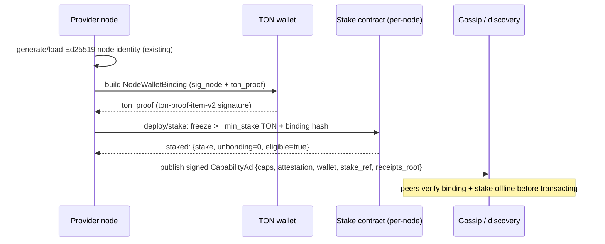

# Blockchain Economic & Incentive Layer (TON) — Design

> Status: **v0.3 — v1 product decisions CONFIRMED and IMPLEMENTED (foundation).**
> The seven product calls formerly open in §14 are **decided** (no bespoke token
> but a transfer-locked stake-receipt jetton; open free tier + optional staking;
> native-TON pricing; hybrid on/off-chain records; non-custodial contracts;
> permissionless anchoring + VRF committees) and the v1 foundation is now **built**:
>
> - **TON smart contracts** (Tolk, built/tested with the **Acton** toolkit) live in
>   [`ton/`](../ton): `StakeVault` + the transfer-locked `StakeReceiptWallet`
>   (§8/§8.5), `JobEscrow` (HTLC-style settlement, §6.2), and `RecordAnchor`
>   (per-epoch Merkle root + dispute, §7/§11). All have Acton/Tolk tests.
> - **Rust `p2p-settlement` crate** ([`crates/settlement`](../crates/settlement))
>   implements the §10.1 trait seams (`Wallet`, `Settlement`, `StakeRegistry`,
>   `RecordAnchor`) with `mock`, genuine `noop` (the free, no-chain path), and
>   `ton` impls, plus `ton_proof` two-way binding verification and Merkle proofs
>   that use the on-chain-aligned **TON cell-representation hash** (§7.2).
> - **Config + integration**: a `[economics]` section (§12), a per-call `payment`
>   override (free|paid|auto), and the coordinator's `stake_factor` seam are wired,
>   all **off by default** (`economics.enabled = false` ⇒ today's free grid).
>
> Everything here *augments and improves* the existing off-chain trust model in
> [`ARCHITECTURE.md`](ARCHITECTURE.md) §7; it does not replace the parts that
> already work well. Live testnet deploy/verify is **complete**: all four contracts
> (StakeVault, RecordAnchor, JobEscrow, GlobalParams) are deployed and `acton verify`
> confirmed on TON testnet. See [`docs/TESTNET.md`](TESTNET.md) and
> [`docker/REPORT.md`](../docker/REPORT.md) for addresses, explorer links, and
> verification proofs.
>
> Reading order: read [`ARCHITECTURE.md`](ARCHITECTURE.md) first (esp. §6 identity,
> §7 trust/reputation/quorum/canary, §8 discovery, §11 hedging, §18 pluggable
> traits). This doc references those sections throughout.

---

## 0. TL;DR (the recommendation in one screen)

- **Money rail:** native **TON** for stake + escrow, held in **non-custodial smart
  contracts no human controls** (code-governed release, not a platform wallet);
  **TON payment channels** for per-job payments so there is **zero gas per job**
  (only open/close on-chain). **Price and settle natively in TON** (no USD peg, no
  price oracle — v1 decision §14.3). Do **not** launch a bespoke governance token;
  avoid the DePIN "subsidy treadmill". The one token we *do* mint is a
  **non-transferable stake-receipt jetton** (see staking bullet).
- **Records:** **don't** write every job on-chain. Keep the existing **signed
  receipts off-chain**, batch them into a **Merkle tree per epoch**, and **anchor
  only the root on-chain**. On-chain holds: stake registry, escrow/channel state,
  slashing events, per-epoch receipt roots, dispute verdicts, wallet-binding hash,
  and the stake-receipt jetton. This **hybrid** split is a confirmed v1 decision
  (§7.3, §14.5) — all-on-chain is explicitly rejected.
- **Selection:** **configurable N**, requester-overridable per job (default `N=5`;
  `3` for public; set e.g. `10` for more redundancy), capped by `n_max`. **Checksum
  minimum = 3 matching results** by default (graceful: if fewer than 3 nodes are
  available/respond, proceed with whatever did). **Only verified-correct runners get
  paid**: the fastest agreeing winner gets base + bonus; **every other participating
  (agreeing) node gets a small, fixed contract-defined commission**; no-shows/wrong
  get nothing; **cheaters get slashed**.
- **Staking:** a **slashable bond** in a **non-custodial, per-node stake contract**
  (no human controls the funds) is the new *primary* Sybil cost and the eligibility
  gate. Staking on deposit mints a **non-transferable stake-receipt jetton** (TEP-74,
  1:1, transfer-locked while bonded/unbonding) as on-chain evidence of the deposit
  (§8.5). Stake boosts ranking through a **diminishing (log, capped) factor** so it
  cannot become pure pay-to-win. PoW identity-minting (§7.1) is demoted to an
  optional free-tier fallback (`min_stake = 0`, public jobs only); vouching stays for
  reputation bootstrapping.
- **Verification of off-chain work** ("verifier's dilemma" / oracle problem) is
  solved by reusing the existing **quorum + commit-first result-hash + canary**
  machinery as the on-chain oracle's truth source, wrapped in **optimistic
  settlement with a challenge window** and bonded fraud proofs.
- **Everything economic is configurable** (`[economics]` config section): min
  stake, fee %, reward weights, `N`, unbonding period, slash %, challenge window.
- **Pluggable seams (future crate `p2p-settlement`):** `Wallet`, `Settlement`,
  `StakeRegistry`, `RecordAnchor` traits — mirrors the existing trait-per-
  collaborator style (§18) so this drops in without rewrites. The trust score
  already has a `stake_factor` / `delta_stake` seam wired to `0.0` today.

---

## 1. Why TON, and what TON actually gives us (with sources)

The grid needs five things from a chain: cheap/fast settlement, escrow, staking/
slashing, a tamper-proof record anchor, and identity binding. TON fits because of
recent performance work and first-class payment channels.

| Capability we need | What TON provides | Source |
|---|---|---|
| Fast settlement / finality | Sub-second finality (~0.8–1 s), 400 ms blocks after **Catchain 2.0** (Apr 2026) | [ton.org](https://ton.org/en/Ton_is_now_up_to_6x_faster), [CoinShares](https://coinshares.com/us/insights/research-data/the-open-network-ton-an-institutional-research-note/), [Messari Q1’26](https://messari.io/report/state-of-the-open-network-q1-2026) |
| Cheap transactions | ~$0.0005 per simple transfer after the May 2026 ~6× fee cut | [Messari Q1’26](https://messari.io/report/state-of-the-open-network-q1-2026), [CoinShares](https://coinshares.com/us/insights/research-data/the-open-network-ton-an-institutional-research-note/) |
| Realistic throughput | Mainnet avg ~40 TPS, bursts ~1,500; plan **100–300 tx/s per contract**; 104K TPS is a lab ceiling | [TON Adoption](https://ton-adoption.xyz/en/blog/sharding-ton-inside-how-high-tps-is-achieved-2026/), [Chainspect](https://chainspect.app/compare/ton-vs-polygon) |
| Gas-free micropayments | **Payment channels**: lock on-chain once, exchange signed off-chain states, ~0.005 TON per on-chain op, only open/close on-chain | [ton.org payments](https://ton.org/en/ton-payments), [ton-blockchain/payment-channels](https://github.com/ton-blockchain/payment-channels), [pc402](https://github.com/TONresistor/payment-channel-402) |
| Smart-contract dev | **Tact** (~33% of deployed contracts, typed/safe) and **FunC**; actor model, async messages, manual gas, bounceable messages | [Cantina](https://cantina.xyz/blog/secure-contract-development-ton-smart-contract-pitfalls), [Tact docs](https://docs.tact-lang.org/book/gas-best-practices/), [TON gas docs](https://docs.ton.org/blockchain-basics/contract-dev/techniques/gas), [smc-guidelines](https://github.com/ton-blockchain/ton/blob/master/doc/smc-guidelines.txt) |
| Tokens | **Jettons** (TEP-74): master + per-holder wallet contracts (sharded) | [Jetton how-it-works](https://docs.ton.org/blockchain-basics/standard/tokens/jettons/how-it-works), [TEP-74](https://github.com/ton-blockchain/TEPs/blob/master/text/0074-jettons-standard.md) |
| Staking / slashing prior art | Nominator pool & liquid-staking: collateral, slashing, **stake held until ≥3 validator-set changes** (unbonding), keeper-triggered recovery with bounty | [liquid-staking-contract](https://github.com/ton-blockchain/liquid-staking-contract), [nominator-pool/pool.fc](https://github.com/ton-blockchain/nominator-pool/blob/main/func/pool.fc), [Controller](https://ton-ls-protocol.gitbook.io/ton-liquid-staking-protocol/protocol-components/validator-components/controller) |
| Wallet ↔ identity binding | **TON Connect `ton_proof`** (`ton-proof-item-v2`): Ed25519 sig over domain+timestamp+nonce, pubkey from wallet StateInit | [TON Connect protocol](https://docs.ton.org/applications/ton-connect/api-reference/protocol), [verifying-signed-in-users](https://github.com/ton-community/ton-docs/blob/main/docs/v3/guidelines/ton-connect/verifying-signed-in-users.mdx) |

### TON properties that shape the design (don't fight them)

- **Asynchronous actor model, non-deterministic message order, no shared global
  state, manual gas, bounceable messages.** Contracts must be written defensively
  (gas pre-checks, carry-value in the payload, handle bounces). This is the single
  biggest difference from EVM and the source of most TON bugs.
  ([Cantina](https://cantina.xyz/blog/secure-contract-development-ton-smart-contract-pitfalls))
- **Cross-shard messages are not atomic; "one contract, one shard."** A hot
  contract is a single-shard bottleneck. → We must **shard the economic state**
  (per-node stake/channel contracts, like Jetton's "one wallet, one contract"),
  not funnel every job through one global contract.
- **Storage fees are charged per cell × time.** Storing unbounded data on-chain
  bleeds the contract dry. → **Never store per-job rows on-chain**; anchor roots.
  ([TON gas docs](https://docs.ton.org/blockchain-basics/contract-dev/techniques/gas))

---

## 2. Lessons from prior decentralized-compute markets (and how we avoid the traps)

| Project | Good idea we borrow | Bad outcome we avoid |
|---|---|---|
| **Golem / iEx.ec** | Open task market; verification via redundant execution | Thin demand, clunky UX, verification overhead made small jobs uneconomic |
| **Akash** | **Burn-Mint Equilibrium**, reverse auctions, pricing in stable units; H100 at 60–70% of AWS | Early reliance on emissions; needed BME to decouple price from token volatility ([blockeden](https://blockeden.xyz/blog/2026/04/12/depin-revenue-pivot-token-subsidies-ai-compute-akash-render-ionet/)) |
| **Filecoin** | **PoSt + Merkle/PoDSI anchoring**, collateral + slashing for missed proofs, batched inclusion proofs | Proof systems are heavy; tiny pieces uneconomic without aggregation ([Filecoin PoSt](https://spec.filecoin.io/algorithms/pos/post/), [FRC-58 PoDSI](https://github.com/filecoin-project/FIPs/discussions/512)) |
| **Render** | Reputation tiers, price bands | Single-token volatility for providers |
| **Bittensor** | Continuous scoring of contributors | **Subsidy treadmill**: emit ~7.6–40× more in tokens than real revenue; "85% cheaper" is inflation-funded, not structural ([PANews](https://www.panewslab.com/en/articles/019d20a3-2116-749c-b6bc-301a743663c5)) |

**The structural lesson** ([DEV two-asset](https://dev.to/newtorob/why-decentralized-ai-compute-needs-two-assets-not-one-2a5k),
[Frontiers DePIN tokenomics](https://www.frontiersin.org/journals/blockchain/articles/10.3389/fbloc.2025.1644115/full)):
a single token forced to be *both* governance and payment produces volatility and
the subsidy treadmill. **What I recommend for this project:**

1. **No new governance/utility token at launch.** Use **native TON** for stake +
   payment. This sidesteps the treadmill entirely — providers earn real TON from
   real requesters, never inflation.
2. **Price *and* settle natively in TON (v1 decision §14.3).** No USD peg, no price
   oracle. The Akash/Helium stable-unit insight (insulate both sides from token-price
   swings) was considered but **rejected for v1**: it needs a TON↔USD price feed
   (an extra oracle + trust surface), and for the **short jobs** this grid targets,
   TON volatility between escrow-lock and settlement is negligible. Pricing stays a
   `Settlement`-trait concern, so a stable-unit accounting mode can be added later
   without reworking the rail. Still **no bespoke token** — providers earn real TON
   from real requesters, never inflation.
3. **Demand first.** The economics only work if requesters actually pay. The grid's
   real product (verifiable DuckDB over private data, hedged/quorum execution) is
   the demand driver; the token layer must not paper over a demand gap.

---

## 3. Requirement 1 — Wallet identity (bind a TON wallet to a node)

**Goal:** every node (provider *and* requester) has a TON wallet address that is
cryptographically bound to its existing node identity (Ed25519, `node_id =
b3:BLAKE3(pubkey)`, see [`ids.rs`](../crates/proto/src/ids.rs) and ARCHITECTURE §6).

### 3.1 The binding is a **mutual, two-way signature**

Two keys exist and must be linked:
- the **node identity key** (Ed25519) — already used for mTLS, receipts, vouches;
- the **TON wallet key** (Ed25519 — TON wallets are also Ed25519, conveniently).

A one-way signature is not enough (a node could claim someone else's wallet, or a
wallet could be bound to many nodes). Require **both directions**:

```
NodeWalletBinding {
  node_id,                       // b3:...
  wallet_address,                // TON raw address (workchain:hash)
  node_pubkey,                   // ed25519 (already in receipts)
  wallet_pubkey,                 // ed25519 from wallet StateInit
  // direction 1: node attests the wallet
  sig_node    = Sign_node( "duckdb-p2p-wallet-bind-v1" ‖ wallet_address ‖ nonce ‖ expiry ),
  // direction 2: wallet attests the node via ton_proof
  ton_proof   = ton-proof-item-v2 over { domain, timestamp, payload = node_id ‖ nonce }
}
```

- **Direction 2 uses TON Connect `ton_proof`** verbatim: assemble
  `utf8("ton-proof-item-v2/") ‖ workchain ‖ address ‖ domainLen ‖ domain ‖ ts ‖
  payload`, `sha256`, prepend `0xffff ‖ "ton-connect"`, `sha256` again, verify the
  Ed25519 signature against the wallet pubkey extracted from the wallet
  `StateInit`. This is the standard, audited flow.
  ([protocol](https://docs.ton.org/applications/ton-connect/api-reference/protocol),
  [guide](https://github.com/ton-community/ton-docs/blob/main/docs/v3/guidelines/ton-connect/verifying-signed-in-users.mdx))
- **Direction 1** reuses the existing `Signer` trait
  ([`receipt.rs`](../crates/trust/src/receipt.rs)) — the node already signs things
  with its identity key.
- `payload` carries the requester-issued **nonce + expiry** → replay-proof, time-
  boxed (15 min typical), domain-scoped (prevents cross-app reuse).

### 3.2 Where the binding lives

- **On-chain:** the binding (or just its hash) is recorded **once** in the node's
  per-node **Stake contract** at registration (see §8). This is a one-time write,
  not per-job, so cost is negligible.
- **Off-chain / in gossip:** the `NodeWalletBinding` is added to the signed
  **capability ad** ([`capability.rs`](../crates/proto/src/capability.rs)) so peers
  can verify a counterparty's wallet *before* transacting, without a chain read.
- **Verification is offline** for both directions (pure Ed25519), consistent with
  the project's "no central auth server" principle.

> **Design note:** the node identity key and the wallet key stay **separate**. Do
> not reuse the node key as the wallet key — wallets get rotated, hot/cold split,
> custodied; coupling them would force key reuse across very different threat
> models. The binding record is the join.

---

## 4. Requirement 2 — Provider pricing / earnings model

Providers should **earn more** for: higher success rate, lower latency, larger data
volume processed, and faster completion. We express this as a **provider quality
score `Q`** (drives ranking *and* settlement) plus a **bounded earning function**.

### 4.1 Provider quality score `Q ∈ [0,1]`

Computed by the requester from verified history (signed receipts, §7.3) — the same
data the trust engine already keeps, extended with latency/throughput aggregates:

```
Q = clamp( (w_s·S + w_l·L + w_t·T + w_c·C) / Σw ,  0, 1)  ·  Π_i (1 − P_i)
    (positive terms are a weight-normalized blend; penalties multiply, never subtract)
```

| Term | Meaning | How it's measured (un-gameable source) |
|---|---|---|
| `S` success rate | **confidence-aware** correctness rate `∈[0,1]` (see below) | **Existing** `TrustStore::reputation` from signed receipts, shrunk by the Beta/Wilson lower bound; correctness decided by **quorum + canary**, never self-reported |
| `L` **size-normalized** latency | `clamp(1 − latency / (latency_ref · max(1, bytes/bytes_ref)), 0, 1)` | `latency_ms` in receipts (commit-first); the latency *allowance scales with the verified data volume*, so a big job is not punished for honestly taking longer |
| `T` throughput **as a rate** | `clamp( ln(1 + bytes/latency_ms) / ln(1 + ref_rate), 0, 1)` | bytes per ms of **verified** results only; `ref_rate = throughput_ref_bytes_per_ms` (or `bytes_ref/latency_ref_ms` when 0). A *rate*, not raw volume, so a slow provider that merely touches many bytes can't out-score a fast one |
| `C` completion / ETA honesty | `on_time_completions / accepted` minus an ETA-deviation penalty | compares bid `eta_ms` vs actual `latency_ms` |
| `P_i` penalties | failed canaries, slashes, downtime/missed heartbeats | trust-store penalties + on-chain slash events |

`latency_ref_ms`, `bytes_ref`, `throughput_ref_bytes_per_ms`, and all `w_*` are
**config** (`[economics.quality]`). The log-scaling on `T` means volume helps but
with **diminishing returns**. **`Q` is clamped to `[0,1]`** and penalties apply
**multiplicatively** (a failed canary worth 50% halves `Q`) rather than being
subtracted — so `Q` can never go negative and ranking comparisons stay
well-defined. Implemented in `crates/settlement/src/quality.rs`.

### 4.1.1 Confidence-aware success rate (don't over-trust thin history)

The raw recency-weighted ratio over-trusts a node with only a handful of jobs: a
"3-for-3" newcomer looks identical to a node with a thousand correct jobs, which
makes **reputation farming** cheap. At *selection time* the raw ratio is therefore
replaced by a **Beta/Wilson lower-confidence bound** (`crates/trust/reputation.rs`,
`confidence_reputation`): configurable Beta pseudo-count priors (`prior_alpha`
pseudo-successes, `prior_beta` pseudo-failures) are folded into the observed
counts, and the **Wilson lower bound** at confidence `confidence_z` is returned.
It is monotonically increasing in the observation count, approaches the raw ratio
with overwhelming evidence, and stays well below it for thin history. The raw
`TrustStore::reputation` getter is unchanged (receipts/inspection); only the trust
score's reputation input is shrunk, via the new `TrustStore::confident_reputation`
method. Priors live in `[economics.reputation]` (`prior_alpha`, `prior_beta`,
`confidence_z`).

### 4.2 Earning function (bounded by escrow, rewards speed + quality)

The requester escrows the **max bid** `B`. The winning provider bid `p ≤ B`. The
key trick: **all bonuses are drawn from the escrowed slack `(B − p)`**, so total
payout never exceeds `B` and unspent escrow refunds to the requester.

```
For the winning provider i (verified correct, fastest agreeing):

  base_i  = p_i                                            // their own bid
  perf_i  = ρ · (B − p_i) · Blend_i                        // bonus from slack
  Blend_i = λ_q·Q_i + λ_s·SpeedBonus_i                     // λ_q+λ_s = 1
  SpeedBonus_i = clamp(1 − t_i / t_deadline, 0, 1)         // earlier finish ⇒ more

  payout_i = (base_i + perf_i) · (1 − φ)                   // φ = platform fee
  fee      = (base_i + perf_i) · φ
  refund_requester = B − base_i − perf_i                   // leftover returns
```

For **every other agreeing-correct node** `j` (they did real redundant work that
*is* the verification — the security of the system):

```
  commission_j = κ · payout_win · (1 − φ)   // κ small FIXED contract constant, e.g. 0.02
```

a **flat, contract-fixed** cut of the winner's payout paid to each agreeing
non-winner (not a per-node negotiated amount), funded first from remaining escrow,
else from a small **verification surcharge** the requester pays up front
(`[economics.fees].verification_surcharge`).

- `ρ` (`bonus_aggressiveness`), `κ` (`participation_commission_frac`), `φ`
  (`platform_fee`), `λ_q`, `λ_s`, `t_deadline` are all **config**.
- **"Larger data volume" earns more in absolute terms** because price scales with
  work: providers post a **unit price**, `p = base + unit_price × work_units`, where
  `work_units` derives from `Offer.cost_hint_rows` / scanned bytes. Bigger job →
  bigger `B` → bigger absolute `payout`. Throughput history (`T`) additionally lifts
  ranking → more wins.

### 4.3 Why each term resists gaming

- **Success rate:** decided by quorum hash agreement + canaries, recorded in
  *signed* receipts that are gossiped/DHT-stored independently (ARCHITECTURE
  §7.3 anti-omission). A provider cannot inflate `S` without actually returning
  results that match the honest majority; a wrong result is caught and **slashed**.
- **Latency:** measured by the requester via commit-first timing; a provider can't
  claim a fast time without delivering the matching hash that fast.
- **Throughput/volume:** only **verified** bytes count. Fabricating "I processed a
  huge dataset" yields nothing because the result must hash-match the quorum; a
  canary (a job whose answer the requester knows) catches fabrication.
- **ETA sandbagging** (bid a safe-slow ETA to always look "on time"): penalized by
  the ETA-deviation component of `C`, and out-competed on ranking by honest fast
  bidders.
- **Self-dealing / reputation farming** (run jobs against your own requester to mint
  good receipts): made expensive by (a) **stake at risk**, (b) **real TON fees per
  job**, (c) **wallet-binding** so requester↔provider wallet links are visible and
  collusion-flagged receipts are **discounted**, and (d) **random verifier
  committees** (§11) that the colluder doesn't control.
- **Price undercutting to win then under-deliver:** the bid `p` is what they get;
  under-delivery (wrong/timeout) ⇒ no pay + slash. Cheap correct work is *good* for
  the network — that's the market working.

---

## 5. Requirement 3 — Bidding & ranking

Requester posts a job with a wallet + a **max bid `B`**. Each provider returns a
bid `(price p, quality evidence, stake)`. The existing `Bid` message already
carries `price`, `eta_ms`, `attestation`, and `recent_receipts`
([`messages.rs`](../crates/proto/src/messages.rs)); we extend ranking, not the wire
shape, much.

### 5.1 Bid rank (combine price, quality, stake)

```
gate:  attestation_level ≥ policy.min_level                 // hard gate (existing)
       AND stake_i ≥ min_stake                              // NEW eligibility gate
       AND p_i ≤ B

rank_i = w_Q·Q_i  +  w_K·StakeFactor_i  −  w_P·(p_i / B)    // higher = better
```

- `Q_i` from §4.1; `p_i/B` is the **normalized price** (cheaper ⇒ higher rank).
- `w_Q, w_K, w_P` are **config** (`[economics.ranking]`). Default leans on quality
  and price; stake is a tie-breaker/priority nudge, **not** the dominant term.

### 5.2 Stake factor — diminishing & capped (anti-centralization)

```
StakeFactor_i = min( 1,  ln(1 + stake_i/min_stake) / ln(1 + stake_cap/min_stake) )
```

- **Logarithmic + hard `stake_cap`.** Doubling stake gives ever-smaller ranking
  gains, and beyond `stake_cap` it gives **nothing**. This is the explicit defense
  against "rich-get-richer": whales cannot buy unbounded priority. (`stake_cap`,
  `min_stake` are config.)
- This is exactly the `delta_stake`/`stake_factor` seam that already exists in the
  trust score ([`reputation.rs`](../crates/trust/src/reputation.rs) `TrustInputs`,
  `soft_trust_score`) and is currently passed as `0.0` in the coordinator
  ([`coordinator.rs`](../crates/node/src/coordinator.rs) `effective_trust`). Wiring
  a `StakeRegistry` into that one field is the **minimal integration point**.

### 5.3 Cold-start exploration (so new honest nodes get sampled)

Confidence-aware reputation (§4.1.1) deliberately under-trusts thin history — but
that creates a chicken-and-egg trap: a brand-new honest node can never build
reputation if it is never selected. To break it, candidate ranking adds a
**decaying exploration bonus** (an ε-greedy / uncertainty term) to each
candidate's selection score:

```
bonus_i = exploration_rate · (1 − min(1, observations_i / exploration_saturation))
score_i = clamp( soft_trust_score(...) + bonus_i , 0, 1)
```

A node with no history gets the full `exploration_rate`; the bonus decays linearly
to `0` once it has `exploration_saturation` verified observations. This is applied
in the ranking/selection function (`coordinator.rs::effective_trust`), using the
pure `exploration_bonus` helper in `crates/trust/src/reputation.rs`.
`exploration_rate` defaults to **`0.0`** (pure exploitation — today's behavior);
set a small value (e.g. `0.1`) in `[economics.ranking]` to enable sampling of
newcomers. New honest nodes are thus periodically tried and can earn the
verified history their (pessimistic) confidence-aware score needs.

### 5.3 Bid privacy & anti-front-running (recommended)

Open bids invite **bid-shading and front-running** (a provider sees rivals' prices
and undercuts by a hair; or an observer front-runs). Recommend **commit–reveal**:

1. **Commit:** providers send `H(price ‖ salt ‖ job_id)` within the offer window.
2. **Reveal:** after the window closes, reveal `(price, salt)`; late/non-matching
   reveals are dropped.

This keeps bids private until everyone is committed, killing last-look undercutting
and observer MEV. It's off-chain (in the Offer/Bid exchange) so it costs no gas.

---

## 6. Requirement 4 — Selection: N, quorum, and who gets paid

### 6.1 N = 5 vs 3 — recommendation: **adaptive N tied to quorum**

The existing scheduler uses `replicas k` (default 3) and `quorum q` (default 2),
validated `q ≤ k` ([`config/src/lib.rs`](../crates/config/src/lib.rs) `SchedulerConfig`).
The user suggested top-5. Trade-off:

| | Smaller N (e.g. 3) | Larger N (e.g. 5) |
|---|---|---|
| Cost | Less redundant compute paid for | More verifier reward paid |
| Safety | Quorum margin thin (2-of-3 ⇒ 2 colluders break it) | Bigger honest-majority margin (3-of-5) |
| Latency | Fewer stragglers to wait on | More hedging ⇒ better tail latency |
| Centralization | — | More providers earn per job |

**Recommendation: N is configurable and requester-overridable; the checksum
minimum is a small fixed floor that degrades gracefully.**

```
N = clamp( requester_override ?? n_default(data_class), checksum_min, n_max )
checksum_min       = 3                                    // default min matching results
effective_quorum   = min( checksum_min, responding_nodes ) // graceful degradation
```

- **N (how many nodes run the job)** has a default (`n_default`, e.g. `5`; `3` for
  public) but the **requester can override it per job** — e.g. set `10` for extra
  redundancy — bounded by the configurable `n_max`.
- **Checksum minimum = 3 matching results** by default: a result is accepted once
  **3 nodes agree** on the canonical hash. This is the recommended safety floor.
- **Graceful degradation:** if fewer than 3 eligible nodes are available or respond
  in time, proceed with however many *did* respond (down to 1) and **flag the job as
  lower-assurance** in its record rather than failing — availability never blocks a
  query.
- **Security nuance (stated honestly):** a fixed checksum of 3 is independent of N,
  so with large N (say 10) you accept on 3-of-10 agreement, which tolerates fewer
  colluders *relative to N* than a strict majority would. Operators wanting a strict
  honest-majority guarantee can raise `checksum_min` toward `⌈N/2⌉+1`; for truly
  **sensitive** data prefer **L2 attestation / permissioned sets** over piling on N
  (commodity laptops can't out-redundancy a colluding majority — ARCHITECTURE §7.4).
- `n_default`, `n_public`, `n_max`, `checksum_min`, and graceful degradation are all
  **config** (`[economics.selection]`), overridable per call where allowed.

### 6.2 The payment-vs-redundancy tension (who gets paid when 5 ran but 1 wins?)

This is the crux. Five providers do real work; one result is streamed back. Naive
"winner takes all" **destroys the incentive to be the redundant verifier**, which
is exactly the work that makes the result trustworthy (the verifier's dilemma,
§11). Naive "pay everyone in full" makes redundancy `N×` expensive and invites lazy
copies. The resolution:

```
Settlement after quorum verdict on a job with escrow B:

  winner (fastest, hash == agreed)         → base p_win + perf bonus            (full)
  every other agreeing-correct node        → fixed participation commission     (small)
                                             c = κ · payout_win  (κ small, fixed in contract)
  disagreeing / wrong (hash ≠ agreed)      → NOTHING, and slashed                (§8.4)
  timed-out / no commit                    → NOTHING (no slash unless repeated)
  leftover escrow                          → refund to requester
```

- **Why pay agreeing-but-losing nodes at all?** Because their matching hash is what
  *creates* the checksum quorum — they are the oracle. Every agreeing non-winner
  therefore earns a **small, fixed commission `c = κ · payout_win`** (κ defined in
  the contract, e.g. 1–3%), which makes honest verification a *dominant* strategy
  (defeating the verifier's dilemma). It is a flat, contract-fixed cut of the
  winner's payment — small enough that lazy copying is never profitable (copying is
  anyway impossible without the data + correct execution, and canaries punish
  guessing).
- **Cheaters subsidize honest runners:** slashed stake from wrong-answer providers
  flows partly into the **redundancy reward pool** and partly burned/treasury
  (config split). So honest redundancy can be **net-funded by cheaters**, lowering
  the requester's cost over time.
- **Requester never overpays:** escrow is `B`; all payouts + rewards are bounded by
  `B + verification_surcharge`; unused funds refund.

---

## 7. Requirement 5 — Tamper-proof records (on-chain vs off-chain)

**Constraint:** thousands of nodes, many jobs. Mainnet is ~40 TPS (plan 100–300
tx/s per contract) and storage is billed per cell × time — **per-job on-chain
writes do not scale and would bleed storage fees**. So we split:

### 7.1 What goes ON-CHAIN (rare, small, high-value)

| On-chain item | Frequency | Why on-chain |
|---|---|---|
| Stake registry entry (per node) | once / on change | eligibility + slashing needs authoritative balance |
| Escrow / payment-channel open & close | 2× per channel (not per job) | custody of funds |
| **Per-epoch receipt Merkle root** | once per epoch (e.g. 1/min or 1/hour) | the tamper-proof anchor for *all* jobs in the epoch |
| Slashing events | only on cheating | must be authoritative & public |
| Dispute/challenge verdicts | only on dispute | finality of arbitration |
| Wallet-binding hash | once / on rotation | identity ↔ wallet link |

### 7.2 What stays OFF-CHAIN (high volume) — anchored by Merkle root

Individual **job records** (who bid, who was selected, result hash, verdict,
latency, payment amount) stay off-chain as today's **signed receipts**
([`receipt.rs`](../crates/trust/src/receipt.rs)), but are now:

1. Collected into a per-epoch list, leaves = `BLAKE3(canonical(JobRecord))`.
2. Built into a **Merkle tree**; the **root is anchored on-chain** once per epoch.
3. Any party can later prove a specific job record is in the anchored set with a
   **~1 KB Merkle inclusion proof** — no need to trust a server.

> **Hash alignment (off-chain ↔ on-chain).** A multi-leaf inclusion proof must
> fold to the *same* root the on-chain `RecordAnchor` verifier computes, so the
> internal **node** hash is the **TON cell-representation hash** on both sides —
> `parent = hash(cell{ left:uint256, right:uint256 })`, which reduces to
> `sha256(0x00 0x80 ‖ left ‖ right)` (the `00 80` is the descriptor of an
> ordinary ref-less cell holding 512 byte-aligned bits). The off-chain builder
> ([`merkle.rs`](../crates/settlement/src/merkle.rs)) and the contract
> ([`anchor_types.tolk::hashPair`](../ton/contracts/anchor_types.tolk)) are pinned
> to identical reference values. Leaves are still `BLAKE3(canonical(JobRecord))`
> and are folded **raw** (no on-chain leaf re-hash); the differing leaf vs node
> hash constructions provide natural domain separation. The single-leaf testnet
> e2e never exercised this because there `root == leaf`; the multi-leaf path is
> now tested off-chain (Rust) and on-chain (Acton emulation, 4- and 8-leaf trees,
> incl. tamper rejection).

This is the **Filecoin PoDSI / data-segment pattern** ([FRC-58](https://github.com/filecoin-project/FIPs/discussions/512),
[Boost](https://boost.filecoin.io/experimental-features/data-segment-indexing)):
batch small items, anchor one root, prove inclusion. Batching cuts proof overhead
~90% vs anchoring each item.

```
JobRecord (off-chain, signed; leaf = BLAKE3(canonical(record))):
  job_id, query_hash, requester_wallet, max_bid,
  bids[]: (worker_id, worker_wallet, price_commit, eta),
  selected[]: worker_id,
  result_hash (agreed), verdict per worker, latencies,
  payments[]: (worker_wallet, amount), platform_fee, slashes[],
  epoch, prev_root          // prev_root chains epochs → append-only history
```

- `prev_root` chains each epoch root to the previous → an **append-only history**;
  rewriting old records would change every subsequent root, which is impossible
  once anchored.
- **Immutability** comes from: each record is signed (can't forge a party's
  statement) + the root is on-chain (can't alter the set after the fact) + the
  chain of roots (can't rewrite history). No single party — not even the platform —
  can manipulate a record.
- **Who anchors?** Any node can compute and submit the root; the contract accepts a
  root agreed by a **threshold of stake-weighted signers** (or a rotating anchor
  duty), so anchoring itself isn't a trust bottleneck. Mismatched roots are a
  challengeable dispute (§ diagram d).

### 7.3 Decision (v1): hybrid confirmed — reject all-on-chain

The split above is **confirmed for v1 (§14.5)**: a **hybrid** model, *not* an
all-on-chain ledger.

- **On-chain (rare, small, high-value):** stake registry, escrow/channel state,
  slashing events, per-epoch receipt Merkle roots, dispute verdicts, wallet-binding
  hash, and the **stake-receipt jetton** (§8.5).
- **Off-chain but distributed + Merkle-anchored:** the **individual job records**
  (signed receipts, batched per epoch, inclusion-provable against the anchored root).

**Why we explicitly reject "everything on-chain":** writing every job record on-chain
would (1) hit TON's realistic **~40 TPS-per-shard** ceiling (and "one contract, one
shard" makes a global ledger a single-shard bottleneck — §1), and (2) pay
**permanent per-cell storage fees** for unbounded data. The result is a **bigger**
on-chain footprint *and* a hard scalability cap — the opposite of the goal. The
"no footprint / fully distributed" property the user wants is achieved by having
**no central server** and keeping the chain **light** (anchor roots, not rows) —
**not** by writing every byte on-chain.

---

## 8. Requirement 6 — Staking for access + priority

### 8.1 Stake as the primary Sybil cost (replaces/augments PoW + vouch)

Today Sybil resistance is **PoW identity-minting + vouching + age**
([`sybil.rs`](../crates/trust/src/sybil.rs), ARCHITECTURE §7.1). PoW raises the cost
of *minting* identities but not of *operating* dishonestly. **Stake is strictly
better as an economic Sybil cost**: it puts real capital at risk that can be
*slashed* for misbehavior, not just spent once.

**Recommendation:**

- **Stake becomes the primary eligibility gate** for receiving requests (`stake ≥
  min_stake`). Each fake identity now needs real, lockable, *slashable* TON — Sybil
  swarms become capital-prohibitive.
- **PoW is demoted to an optional free/public tier** (zero-stake nodes may still
  serve `data_class = public` at low ranking and high redundancy), so the network
  stays permissionless for hobbyists. `min_stake = 0` recovers today's behavior.
- **Vouching stays** for **reputation bootstrapping** (a new staked node still
  starts with thin history; a vouch lends initial trust) — it's orthogonal to
  Sybil cost now.
- Net: **augment, not rip-out.** All three coexist; weights/min are config so an
  operator can run pure-PoW (today), pure-stake, or hybrid.

### 8.2 Minimum stake, the free public tier, and requester escrow

**v1 decision (§14.2): open free tier + optional staking; requesters pre-fund.**

- **Hosts may join free (`min_stake = 0`).** A zero-stake host serves only
  `data_class = public` jobs, at **low priority and higher redundancy**. It still
  needs a **bound TON wallet** (§3) to receive pay — joining is free, but getting
  paid requires a payout address.
- **Staking is optional** and buys **priority + access to higher-value/sensitive
  jobs**; `min_stake` (config) gates the non-public tiers, below which a node is
  free-tier/public-only.
- **Requesters must pre-fund escrow** covering **provider payment + platform fee**
  before a job runs. No work is dispatched against an unfunded job; this is what
  guarantees accepted work is always payable (§13 "requester refuses to pay").
- Ranking boost via the **diminishing, capped `StakeFactor`** (§5.2) — log-scaled
  and hard-capped so **more stake → higher priority, but with strong diminishing
  returns and an absolute ceiling**. This is the anti-centralization guardrail.
- Optional **per-class minimums**: `min_stake_sensitive > min_stake_internal >
  min_stake_public`, so higher-value work requires more skin in the game.

> **Custody (v1 decision §14.6): non-custodial.** Both the host's stake and the
> requester's escrow are held in **smart contracts that no human controls** —
> release is governed entirely by contract code (quorum verdict, challenge window,
> unbonding cooldown), **not** by a platform-controlled wallet. The platform never
> takes custody of user funds. This **reduces (does not eliminate)** money-
> transmitter / KYC / AML exposure. *This is not legal advice; confirm obligations
> per jurisdiction.*

### 8.2.1 Free vs paid path — settlement is optional & per-job; scoring always runs

A **fully free, no-cost, no-fee path that never touches the blockchain** is a
first-class mode, not an afterthought. It is selectable globally **and** per-job,
and free jobs coexist with paid jobs on the same network.

- **Two decoupled concerns.** *Settlement* (chain + fees) is **optional and
  per-job**. *Scoring* (reputation + quality `Q`) is **independent and always
  runs**. Turning the chain off never turns scoring off.
- **A free job** opens **no escrow**, engages **no stake / settlement / record-
  anchor**, pays **no platform/verification fees**, and writes **nothing on-chain**.
  Correctness still comes from the existing off-chain machinery — quorum +
  commit-first result hash + canary + signed receipts — and the result **still
  updates the `TrustStore` reputation and `Q`** (success rate, latency,
  throughput). A node builds reputation from free work exactly as from paid work.
- **Free nodes.** A `min_stake = 0` host serves free/public jobs with **no wallet,
  stake, or settlement** involvement at all. A wallet is required only if it wants
  to earn **paid** jobs. (Hosts advertise which they accept in their capability ad.)
- **Path selection is cheap & local.** A free job routes straight through the
  off-chain coordinator and is backed by the genuine no-op impls
  (`NoopSettlement` / `NoopStakeRegistry` / `NoopRecordAnchor`) — it **never
  instantiates a TON client** and runs even when no chain/wallet is configured.
  Only **paid** jobs construct an escrow and engage `crates/settlement`'s `ton`
  impls. (Enforced in code by `settle_if_paid`, which for a free job returns
  without calling the settlement rail at all — covered by a spy test that panics
  if settlement is touched on a free job.)

**Per-job mode resolution** (highest precedence first), all configurable, nothing
hard-coded:

1. **per-call SQL override** — `p2p_query(..., payment => 'free' | 'paid' | 'auto')`;
2. **data-class policy** — `auto` ⇒ `public` → free, `internal`/`sensitive` → paid;
3. **config default** — `[economics].default_payment`;
4. **global master switch** — `[economics].enabled`; when `false`, **every job is
   free** regardless of the above (this is today's behavior and the default).

The only economics-gated input to selection is the `stake_factor` term in the
trust score (§5.2): it is non-zero **only** for a paid job while `economics.enabled`
and a `StakeRegistry` is wired; otherwise it is `0.0`. The reputation/receipt
update path is **separate** and unconditional, so disabling the chain never
disables scoring.

> **Platform fee recipient is configurable.** When paid settlement is on, the
> platform fee is paid to `[economics].fee_recipient` (a TON address). It is
> *required* once `economics.enabled` and `settlement != "noop"`, and validated as
> such. No fee recipient is needed (or charged) on the free path. This keeps the
> custody story non-custodial: the contract code, not a platform wallet, governs
> release; the fee simply has a configurable destination.

### 8.3 Slashing conditions (graduated)

| Condition | Detected by | Slash (config default) |
|---|---|---|
| **Wrong result** (hash ≠ quorum-agreed, or fails canary) | quorum + canary (§7.4) | `slash_wrong_result` (e.g. 10–30% or a fixed bond unit) |
| **Provable cheating / data exfiltration signal** | dispute with fraud proof | `slash_cheat` (up to 100%) |
| **Downtime / missed heartbeats while advertising capacity** | gossip liveness + missed dispatches | `slash_downtime` (small, e.g. 1–5%) |
| **Equivocation** (two conflicting signed commits for one job) | conflicting receipts | `slash_equivocation` (high) |
| **Failing to anchor / wrong root when on anchor duty** | root mismatch challenge | `slash_anchor` (medium) |

- Slashed funds split (config): **redundancy-reward pool / honest challenger
  bounty / burn / treasury**. Paying the **challenger a bounty** from the slash is
  what makes someone bother to challenge (defeats verifier's dilemma; mirrors
  TON's keeper-bounty pattern in the nominator pool where *anybody* can trigger an
  action for a reward).
- **Slashing is graduated and appealable** via the dispute path (§ diagram d) with
  a challenge window before funds are irreversibly moved (optimistic settlement).

### 8.4 Unbonding period

- Stake withdrawal has a **cooldown / unbonding period** (config
  `unbonding_secs`), during which the stake is **still slashable** for jobs done
  before withdrawal. This prevents "cheat then instantly exit with the bond."
- Modeled on TON staking, where stake is held until **≥3 validator-set changes /
  `stake_held_for`** before recovery ([nominator-pool](https://github.com/ton-blockchain/nominator-pool/blob/main/func/pool.fc),
  [Controller](https://ton-ls-protocol.gitbook.io/ton-liquid-staking-protocol/protocol-components/validator-components/controller)).
- `unbonding_secs` **must be ≥ the dispute `challenge_window`** so a cheater can't
  withdraw before a fraud proof can land. (A config-validation invariant, §12.)
- Keeper pattern: after cooldown, **anybody** can trigger the payout-to-owner and
  earn a small bounty if the owner is unresponsive (TON idiom) — keeps withdrawal
  liveness without a central operator.

### 8.5 Stake-receipt jetton (non-transferable proof of bond)

When a host stakes, its per-node Stake contract **mints a stake-receipt jetton
(TEP-74) 1:1** with the deposited TON, as on-chain evidence of the bond. This is
inspired by **Hipo's hTON** liquid-staking receipt ([hipo.finance](https://hipo.finance/),
[HipoFinance GitHub](https://github.com/HipoFinance)), which mints a transferable
token representing staked TON.

**Critical difference from hTON: our receipt is transfer-locked.** Because our stake
is a *slashable accountability bond* (not a yield-bearing liquid-staking position), a
freely transferable receipt would let a host **sell the receipt and exit to dodge
slashing** while a fraud proof is still possible. Therefore:

- **1:1 backed** — exactly one receipt unit per staked TON unit; minted on deposit,
  burned on withdrawal.
- **Transfers are LOCKED while the stake is bonded and during the unbonding window**
  (`receipt_transfer_locked = true`, §12). Only after unbonding completes and the
  bond is released does the receipt burn; it is never transferable in between.
- **Purpose is evidence, not liquidity:** the receipt is a verifiable, on-chain
  attestation that "this node holds a live slashable bond of size X", consumable by
  other contracts/dapps — *without* creating a tradable claim that breaks slashing.
- Implemented with the standard TEP-74 master + per-holder wallet pattern
  ([TEP-74](https://github.com/ton-blockchain/TEPs/blob/master/text/0074-jettons-standard.md),
  [Jetton how-it-works](https://docs.ton.org/blockchain-basics/standard/tokens/jettons/how-it-works)),
  with the transfer entrypoint gated on bond state. This is **not** a governance or
  utility token and is **not** inflationary — it is a fully-collateralized receipt.
- **TEP-64 metadata ("Duckton").** The receipt jetton carries on-chain
  [TEP-64](https://github.com/ton-blockchain/TEPs/blob/master/text/0064-token-data-standard.md)
  metadata so wallets/explorers render it: **name "Duckton", symbol "DUCKTON",
  decimals 9**, plus a short description. The `StakeVault` (the receipt's master)
  exposes `get_jetton_data` (TEP-74/TEP-89) returning `(total_supply, mintable,
  admin_address = the vault, jetton_content, jetton_wallet_code)`, where
  `jetton_content` is the standard on-chain dictionary content cell
  (`buildReceiptJettonContent` in `ton/contracts/stake_types.tolk`). The metadata
  is **display-only**; the transfer lock is unchanged — Duckton remains
  non-transferable. (Acton test: `stake-receipt jetton exposes Duckton TEP-64
  metadata`.)

### 8.6 In-place code upgradeability vs the non-custodial guarantee (timelocked)

TON contract code can be upgraded **in place** via the TVM `SETCODE` action
(Tolk `contract.setCodePostponed(newCode)`): the code is swapped **without
changing the contract address or wiping storage** (the address is
`hash(StateInit)`, fixed at deploy; `SETCODE` only replaces the code register,
and we never call `setData` to wipe data). `SETCODE` is **postponed** — the new
code takes effect only *after* the current transaction terminates successfully,
so the message that triggers the upgrade is processed by the OLD code and the
NEXT message runs the new code over the same (preserved) storage. This is the
fix for "address changes when code changes": adding a field/getter no longer
forces a redeploy to a fresh address. Each upgradable contract carries a
monotonic **`codeVersion`** (separate from `paramsVersion`), bumped by the
contract on every successful upgrade, exposed via `get_code_version`.

**The tension for `StakeVault`.** The vault holds stakers' bonds
**non-custodially**: release is governed *only* by code (deposit / unbond
cooldown / slashing / keeper). An **arbitrary admin code-swap would BREAK that
guarantee** — whoever could replace the code could insert a "drain to me" path
and rug every bonded host. So the vault is upgradable, but the upgrade path is
deliberately constrained so it **cannot be used to rug**:

- **Governance-gated, not an arbitrary key.** Only `config.slasher` (the
  configured slasher / governance authority — intended to be a dispute/governance
  contract or multisig) may announce/apply/cancel an upgrade.
- **Two-step + TIMELOCKED.** `announce_upgrade(newCodeHash)` commits to the
  successor code's cell hash and starts a clock; `apply_upgrade(newCode)` is
  **rejected until `announced_at + unbonding_period`** has elapsed
  (`ERROR_UPGRADE_TIMELOCK_ACTIVE`). Because `unbonding_period ≥ challenge_window`
  (a §12 invariant), **any staker who distrusts an announced upgrade has at least
  the full unbonding window to `request_unbond` and exit under the CURRENT,
  trusted code before the new code can take effect.** The pending announcement is
  publicly observable via `get_pending_upgrade` (hash, announced-at, ready-at).
- **Commit-then-reveal.** `apply` must present code whose hash equals the
  announced hash (`ERROR_UPGRADE_CODE_MISMATCH`), so the swap is exactly what was
  published — no bait-and-switch.
- **Cancellable.** `cancel_upgrade` lets governance abort a bad announcement.

This is the explicit, deliberate tradeoff: **in-place upgradeability is retained,
but the non-custodial promise is preserved** by guaranteeing an exit window
before any code change lands. Contrast the other contracts:

- **`GlobalParams` (singleton policy):** admin-gated `upgrade_code`, **no
  timelock** — it holds *no user funds*, so an immediate in-place upgrade is the
  intended primary win (e.g. ship a new `EcoParams` getter/field without moving
  the hard-pinned address). See §12.1.
- **`RecordAnchor`:** authority-gated `upgrade_code` (the `verdictAuthority`), no
  timelock — it holds only refundable dispute bonds and the epoch Merkle chain;
  upgrading in place avoids orphaning the anchored history at a new address.
- **`JobEscrow` (per-job, ephemeral HTLC): intentionally NOT upgradable.** A live
  per-job escrow is a short-lived HTLC whose guarantees (settle-on-quorum-hash /
  refund-on-timeout, bounded by the locked `B`) the requester relied on at funding
  time; allowing a mid-flight code swap would let those guarantees be rewritten
  under an in-flight job. There is **no `set_code` handler** on `JobEscrow`. New
  jobs automatically pick up the current escrow template code at deploy, so the
  contract still "evolves" — only *already-open* escrows are immutable, by design.
- **`StakeReceiptWallet`: left standard (not upgradable).** The receipt wallet is
  a minimal, transfer-locked balance tracker minted/burned by its master vault; it
  holds no TON and has no admin. We deliberately leave it **non-upgradable** to
  keep its attack surface minimal. If a wallet-code change were ever needed it
  would ride the **vault's** timelocked governance (the vault is the master and
  pins `receiptWalletCode`), inheriting the same exit-window protection — but no
  such handler is shipped in v1.

**Storage-migration rule (all upgradable contracts).** New code must read the
*existing* storage layout. Keep changes **additive**: append new fields LAST
(older fields read unchanged). `codeVersion` (and the vault's timelock state) are
appended as such; the vault groups its upgrade state in a **child cell** (a
`^ref`) both to stay within the 1023-bit root-cell budget and to decouple the
delicate upgrade path from the hot bond data. If a real layout migration is ever
needed, it is staged **inside the upgrade handler before `save()`** — the OLD
code still controls the layout in that transaction (because `SETCODE` is
postponed), so it can `setData()` the migrated cell and only then hand off to the
new code.

---

## 9. End-to-end flows (mermaid)

### (a) Provider onboarding + staking



### (b) Full job lifecycle (escrow → bid → select → execute → verify → settle → anchor → reputation)

```mermaid
sequenceDiagram
    participant R as Requester
    participant CH as Payment channel / Escrow
    participant D as Discovery
    participant Ws as Providers (N selected)
    participant Q as Quorum/Canary verifier (existing)
    participant A as RecordAnchor (epoch Merkle root)

    R->>CH: ensure channel open / escrow max_bid B (off-chain after open)
    R->>D: find candidates (capacity, trust, attestation, stake>=min)
    R->>Ws: Offer(job, B) + commit window
    Ws-->>R: Bid commit H(price|salt)         %% commit-reveal (anti-MEV)
    Ws-->>R: Reveal (price, salt)
    Note over R: rank = w_Q·Q + w_K·StakeFactor - w_P·(p/B); pick top-N (adaptive)
    R->>Ws: Dispatch(SQL, scoped creds/sealed key) to N
    Ws->>Ws: locked-down DuckDB execution (existing sandbox)
    Ws-->>R: commit-first result_hash (+ latency)
    R->>Q: evaluate quorum (>= q matching hashes) / canary check
    Q-->>R: agreed_hash + verdicts
    R->>Ws: Ack winner (stream result); RESET losers
    Note over R,CH: settle off-chain via channel:
    R->>CH: pay winner base+perf; pay agreeing runners σ·p; slash wrong
    R->>R: emit signed receipts (existing) + JobRecord
    R->>A: append JobRecord leaf to current epoch tree
    A->>A: (epoch end) anchor Merkle root on-chain
    R->>R: update reputation/Q (existing TrustStore.record)
```

### (c) Stake unbonding / withdrawal

```mermaid
sequenceDiagram
    participant P as Provider
    participant SC as Stake contract
    participant K as Keeper (anyone)
    P->>SC: requestUnbond(amount)
    SC-->>P: unbonding started; eligible=false for new high-tier jobs
    Note over SC: cooldown = unbonding_secs (>= challenge_window); still slashable
    alt no slash during cooldown
        P->>SC: withdraw() after cooldown
        SC-->>P: release funds
    else owner unresponsive after cooldown
        K->>SC: triggerWithdraw() (TON keeper idiom)
        SC-->>P: release funds to owner
        SC-->>K: small bounty
    else slash lands during cooldown
        SC->>SC: apply slash, reduce releasable amount
    end
```

### (d) Dispute / challenge (optimistic settlement + fraud proof)

```mermaid
sequenceDiagram
    participant C as Challenger (anyone, bonded)
    participant DC as Dispute contract
    participant CT as Verifier committee / canary oracle
    participant SC as Stake contract
    Note over DC: settlement is OPTIMISTIC: payouts/roots final after challenge_window
    C->>DC: openChallenge(job_id|epoch_root, inclusion proof, bond)
    DC->>CT: request adjudication (recompute on trusted/L2 node or random committee)
    CT-->>DC: verdict (cheater = worker X / root invalid / challenge frivolous)
    alt challenge upheld
        DC->>SC: slash cheater; pay challenger bounty from slash
        DC->>DC: correct the record; reverse wrongful payment
    else challenge rejected
        DC->>C: forfeit challenger bond (anti-griefing)
    end
```

---

## 10. How this changes & improves the existing architecture

The economic layer is **additive** and rides the existing seams. Mapping to the
current code:

| Existing piece | Stays off-chain (perf) | Gets on-chain anchor/extension |
|---|---|---|
| **Node identity** (`ids.rs`, mTLS) | unchanged | + wallet binding record |
| **Reputation** (`reputation.rs` `TrustStore`) | stays the hot path | `stake_factor` fed by `StakeRegistry`; receipts batched → root anchored |
| **Receipts** (`receipt.rs`) | stay signed, gossiped | hashed into epoch Merkle root |
| **Quorum + canary** (`canonical.rs`, `canary.rs`) | stays the verification oracle | its verdict triggers settlement + slashing |
| **Capability tokens** (`token.rs`) | unchanged | mint gated on `stake ≥ min_stake` |
| **Discovery ranking** (`coordinator.rs`, `discovery.rs`) | local, bounded sample | rank gains price + stake terms |
| **Sybil** (`sybil.rs` PoW/vouch) | optional free tier | stake becomes primary cost |

### 10.1 Recommended pluggable trait seams (future crate `p2p-settlement`)

Mirrors ARCHITECTURE §18 (a trait per collaborator, mock + real impls). **None of
these are implemented yet** — they are the proposed interfaces so the feature drops
in later without rewrites. Sketch (illustrative, not in the build):

```rust
/// Bind & verify wallet <-> node identity. Mock impl for tests; TON Connect impl later.
pub trait Wallet: Send + Sync {
    fn address(&self) -> WalletAddress;
    fn verify_binding(&self, b: &NodeWalletBinding) -> bool;     // both directions
}

/// Money rail. Off-chain payment-channel impl is the recommended default; a
/// direct on-chain impl and a `NoopSettlement` (today's free grid) plug in too.
pub trait Settlement: Send + Sync {
    fn open_escrow(&self, job: &JobId, max_bid: Amount) -> EscrowHandle;
    fn pay(&self, to: &WalletAddress, amount: Amount, h: &EscrowHandle) -> Result<(), SettleError>;
    fn refund(&self, h: &EscrowHandle) -> Result<(), SettleError>;
}

/// Stake / bond / slash. Feeds the EXISTING `TrustInputs.stake_factor` (today 0.0).
pub trait StakeRegistry: Send + Sync {
    fn stake_of(&self, node: &NodeId) -> Amount;
    fn is_eligible(&self, node: &NodeId, class: DataClass) -> bool;
    fn stake_factor(&self, node: &NodeId) -> f64;               // diminishing, capped
    fn slash(&self, node: &NodeId, reason: SlashReason) -> Result<(), SlashError>;
    fn request_unbond(&self, node: &NodeId, amount: Amount) -> Result<(), SlashError>;
}

/// Tamper-proof record anchoring (off-chain tree, on-chain root).
pub trait RecordAnchor: Send + Sync {
    fn append(&self, record: &JobRecord);                       // off-chain leaf
    fn epoch_root(&self) -> MerkleRoot;                         // anchored on-chain
    fn prove_inclusion(&self, job: &JobId) -> Option<InclusionProof>;
    fn verify_inclusion(root: &MerkleRoot, p: &InclusionProof) -> bool;
}
```

The **single smallest wiring change** that turns staking on: have the coordinator's
`effective_trust` read `StakeRegistry::stake_factor(worker)` instead of the literal
`0.0` it passes today — the `delta_stake` weight already exists in config and the
soft-score formula.

---

## 11. Verifier's dilemma / oracle problem (how a contract trusts off-chain work)

A smart contract cannot see whether a DuckDB query was run correctly (the **oracle
problem** — [Chainlink](https://chain.link/education-hub/oracle-problem)), and
rational verifiers are tempted to skip expensive checks (the **verifier's dilemma**
— [Luu et al. 2015](https://eips.ethereum.org/assets/eip-2982/iacr-2015-702-Demystifying-Incentives-in-the-Consensus-Computer.pdf),
[opML](https://ar5iv.labs.arxiv.org/html/2401.17555)). We already have the right
off-chain truth source; we wrap it correctly:

1. **The grid's quorum + commit-first result-hash + canary is the oracle.** The
   contract never recomputes SQL; it consumes the **verdict** (agreed hash +
   per-worker correctness) the requester already produces (ARCHITECTURE §7.4).
2. **Optimistic settlement + challenge window.** Payouts and epoch roots are
   provisional until `challenge_window` elapses. Anyone can submit a **bonded fraud
   proof** (a Merkle inclusion proof of a record + evidence the hash disagrees with
   a recomputation on a trusted/L2 node). Upheld challenge ⇒ slash + **challenger
   bounty from the slash**; frivolous ⇒ forfeit bond. The bounty is what makes
   verification *incentive-compatible* (directly attacks the dilemma; the opML
   payoff-matrix result).
3. **Random verifier committees for high-value jobs.** Beyond the N runners, draw a
   small **randomly-sampled, stake-weighted committee** (VRF-style) to recompute a
   canary slice. The job poster can't predict/collude with the committee.
4. **Honest-majority is still the limit** (ARCHITECTURE §7.4): for *sensitive* data
   prefer **L2 TEE attestation** (hardware proves correct execution) over piling on
   redundancy. Stake makes collusion *expensive* (must corrupt ⌈N/2⌉ bonded,
   wallet-bound nodes and survive the challenge window) but never *impossible*.

---

## 12. Configuration knobs (nothing hard-coded)

A new `[economics]` section, consistent with ARCHITECTURE §17 (defaults < file <
env < per-call) and `deny_unknown_fields`. All values illustrative defaults.

```toml
[economics]
enabled              = false      # master switch; false = today's free grid (no chain)
settlement           = "noop"     # "noop" | "channel" | "onchain"
custody              = "noncustodial" # funds live in code-governed contracts, no platform wallet
accounting_unit      = "ton"      # v1: price AND settle natively in TON, no USD peg / oracle
chain                = "ton"
network              = "mainnet"  # "-239" mainnet / "-3" testnet
default_payment      = "auto"     # per-job default: free | paid | auto (per-call overridable)
                                  # auto => public:free, internal/sensitive:paid
# fee_recipient      = "EQ...treasury"  # configurable platform fee-recipient address;
                                  # REQUIRED once enabled = true AND settlement != "noop"

[economics.stake]
min_stake            = 0          # 0 = permissionless/free tier (public jobs only)
min_stake_internal   = 100        # per-class minimums (TON)
min_stake_sensitive  = 1000
stake_cap            = 100000     # ranking ceiling (anti-centralization)
unbonding_secs       = 604800     # >= challenge_window (validated); receipt stays transfer-locked
receipt_jetton           = true   # mint a 1:1 TEP-74 stake-receipt jetton on deposit (§8.5)
receipt_transfer_locked  = true   # receipt is non-transferable while bonded/unbonding (anti-exit)

[economics.ranking]
w_quality            = 0.6
w_stake              = 0.15
w_price              = 0.25
# StakeFactor is log-scaled between min_stake and stake_cap
exploration_rate       = 0.0      # cold-start ε (§5.3): 0 = off; ~0.1 samples new nodes
exploration_saturation = 20       # observations at which the exploration bonus hits 0

[economics.quality]              # weights for Q (success/latency/throughput/eta)
w_success            = 0.5
w_latency            = 0.2        # size-normalized latency (allowance scales with bytes)
w_throughput         = 0.2        # throughput-as-rate (bytes/ms), log-scaled
w_completion         = 0.1
latency_ref_ms       = 5000
bytes_ref            = 1073741824 # 1 GiB reference for log throughput scaling
throughput_ref_bytes_per_ms = 0   # 0 => derive ref rate from bytes_ref / latency_ref_ms

[economics.reputation]           # confidence-aware reputation priors (§4.1.1)
prior_alpha          = 1.0        # Beta pseudo-successes
prior_beta           = 2.0        # Beta pseudo-failures (pessimistic about thin history)
confidence_z         = 1.96       # Wilson lower-bound z (≈95%); 0 = posterior mean

[economics.selection]
n_public             = 3          # default N for public/low-value jobs
n_default            = 5          # default N for internal/high-value jobs
n_max                = 10         # ceiling on requester overrides
requester_overridable = true      # requester may set N per job (<= n_max)
checksum_min         = 3          # min matching results to accept (safety floor)
checksum_allow_degraded = true    # if < checksum_min nodes respond, proceed + flag

[economics.fees]
platform_fee_pct          = 0.02
verification_surcharge_pct = 0.05
participation_commission_frac = 0.02 # kappa: FIXED contract cut of winner payout per agreeing non-winner
bonus_aggressiveness       = 0.5  # rho: how much escrow slack funds the perf bonus
lambda_quality             = 0.5  # blend of quality vs speed in the bonus
lambda_speed               = 0.5

[economics.slashing]
slash_wrong_result_pct = 0.15
slash_cheat_pct        = 1.0
slash_downtime_pct     = 0.02
slash_equivocation_pct = 0.5
challenge_window_secs  = 86400    # optimistic settlement window
# split of slashed funds:
slash_to_challenger    = 0.4
slash_to_redundancy    = 0.3
slash_to_burn          = 0.2
slash_to_treasury      = 0.1

[economics.records]
epoch_secs           = 60         # how often the receipt Merkle root is anchored
anchor_quorum_pct    = 0.66       # stake-weighted signers needed to accept a root
```

**New cross-field invariants** (extend `GridConfig::validate`, ARCHITECTURE §17):
`unbonding_secs ≥ challenge_window_secs`; `slash_to_* sum == 1.0`; all `_pct ∈
[0,1]`; `checksum_min ≥ 1`; `n_max ≥ n_default ≥ n_public ≥ checksum_min`;
`participation_commission_frac` small (≤ ~0.1); ranking weights ≥ 0; quality
weights ≥ 0; reputation priors (`prior_alpha`, `prior_beta`, `confidence_z`) ≥ 0;
`exploration_rate ∈ [0,1]`; `min_stake_sensitive ≥ min_stake_internal ≥
min_stake`.

### 12.1 On-chain `GlobalParams` contract (params live on-chain too)

The `[economics]` knobs above are the **off-chain** node configuration. Their
ecosystem-wide counterparts also live on-chain in a single **`GlobalParams`**
contract ([`ton/contracts/GlobalParams.tolk`](../ton/contracts/GlobalParams.tolk))
so every contract / node reads one authoritative source:

- Holds `platform_fee`, `fee_recipient`, `surcharge`, `participation_commission`,
  the slash %s + split, the min-stake tiers, `stake_cap`, `unbonding`/`challenge`
  windows, default selection `N`/quorum/checksum, and the ranking weights — all in
  their on-chain representation (bps / nanoton / seconds), packed into an
  `EcoParams` child cell.
- **Editable in place, address stable.** An admin-gated `update_params`
  **mutates storage** (there is *no* redeploy), so the contract address never
  changes and other contracts can hard-pin it. Each update is **bounds-validated
  on-chain** (`validateEcoParams` mirrors the §12 invariants), **emits a
  `ParamsUpdated` log**, and **rejects unauthorized senders** (`ERROR_NOT_ADMIN`).
- **Upgradable in place, address stable (the CODE too).** Beyond data, the
  **code** is upgradable without moving the address: an admin-gated
  `upgrade_code(newCode)` runs the TVM `SETCODE` action
  (`contract.setCodePostponed`), swapping the contract code while the address and
  all storage are preserved (no redeploy). This is the fix for *"the address used
  to change whenever the code changed"* — e.g. adding a new `EcoParams` getter/
  field now ships in place (proven end-to-end: deploy → `upgrade_code` to
  `GlobalParamsV2` which adds `get_surcharge_bps`, address unchanged). A monotonic
  **`codeVersion`** (separate from `paramsVersion`, read via `get_code_version`)
  is bumped by the contract on each upgrade and a `CodeUpgraded` log is emitted;
  non-admin senders are rejected (`ERROR_NOT_ADMIN`). `GlobalParams` has **no
  timelock** (it custodies no user funds); the fund-custody `StakeVault` instead
  uses a **timelocked, governance-gated** upgrade (see §8.6), and `JobEscrow` is
  intentionally non-upgradable. The off-chain builder
  `p2p_settlement::build_upgrade_code` mirrors the message ABI, and
  `GlobalParamsClient::code_version()` reads the live code version. Acton tests
  cover: in-place upgrade (address stable, state preserved, `codeVersion` bumped,
  the v2-only getter live), and non-admin rejection.
- **Admin model.** The admin is a single configurable address today, **designed to
  later point at a multisig** — `update_admin` rotates it (e.g. single key →
  multisig). Acton tests cover: admin update persists + address unchanged;
  non-admin rejected; out-of-bounds rejected; admin rotation.
- **Off-chain side.** Nodes derive the same params from `[economics]` via
  `p2p_settlement::GlobalParams::from_economics` (single source of truth), and new
  escrow/stake instances are parameterized from them. The admin SQL setter
  **`CALL p2p_admin_params()`** prepares an `update_params` from the configured
  admin wallet (`crates/extension`), gated on on-chain settlement +
  `guard_mainnet()` + a registered `global_params` address. The deployed address
  is configured per network under `[economics.<net>.contracts].global_params`.

- **Governance blocklist (anti-abuse).** `GlobalParams` also carries an
  admin-gated **governance blocklist** (`SetBlocklisted` op + `get_blocklisted`
  getter; storage `blocklist: map<uint256, uint1>` keyed by the subject's
  account hash) for **egregious provable** cases. It is purely additive and
  optional: a node consults it only when `[antiabuse.blocklist].honor_global_params`
  is set, and even then each node still decides independently (it is *one source*
  of deny-list input, not a central authority that forces a refusal). The
  primary deny-lists remain **local** (`p2p_block` / `p2p_unblock` /
  `p2p_blocklist`, persisted off-chain). See ARCHITECTURE §20 "Abuse resistance".

---

## 13. Better ideas / opinionated recommendations

**Recommend (build these):**

- **Payment channels per (requester,provider) pair for gas-free per-job pay.**
  Open once, settle thousands of jobs off-chain via signed semi-channel states,
  close once. This is *the* feature that makes a high-frequency compute market
  viable on any chain. ([pc402](https://github.com/TONresistor/payment-channel-402),
  [ton-blockchain/payment-channels](https://github.com/ton-blockchain/payment-channels))
- **Batched Merkle-root anchoring of receipts (PoDSI-style).** Cheap, scalable,
  tamper-proof, provable inclusion. The right answer for "thousands of nodes, many
  jobs." ([FRC-58](https://github.com/filecoin-project/FIPs/discussions/512))
- **Optimistic settlement + bonded fraud proofs + challenger bounty from slashes.**
  Makes verification incentive-compatible; reuses your quorum/canary as the oracle.
- **HTLC-style escrow release keyed on the quorum result-hash.** Funds unlock only
  when ≥`q` workers commit the agreed hash — payment is *cryptographically* tied to
  a verified result, not to a trusted party flipping a flag.
- **Diminishing, capped stake-weighting + commit–reveal sealed bids.** The two
  guardrails against centralization and bid MEV, respectively.
- **Price and settle natively in TON; no bespoke token, no price oracle**
  (v1 decision §14.3). Avoids the DePIN subsidy treadmill outright and keeps the
  rail oracle-free.

**Consider (nice, not day-1):**

- **Reputation as a soulbound token (SBT).** A non-transferable on-chain credential
  summarizing `Q`/history. *Pro:* portable, composable, hard to wash-trade (can't
  sell reputation). *Con:* the gossiped signed-receipt trail already gives
  portability off-chain; an SBT mainly helps *cross-app* reputation and on-chain
  gating. Recommend **only if** other TON dapps want to consume the grid's
  reputation; otherwise it's premature on-chain state. **Never make reputation
  transferable** — that recreates a reputation market.
- **Random stake-weighted verifier committees (VRF).** Strong for high-value jobs;
  adds protocol complexity — gate behind `data_class`/value thresholds.

**Avoid:**

- **A new inflationary governance/utility token at launch.** This is the single
  most common DePIN failure (Bittensor 7.6–40× emit-to-revenue,
  [PANews](https://www.panewslab.com/en/articles/019d20a3-2116-749c-b6bc-301a743663c5)).
- **Writing every job on-chain.** Storage-fee suicide and throughput-bound.
- **Buying safety with ever-larger N on commodity laptops.** Colluding majorities
  still win quorum; use L2/permissioned sets for truly sensitive data.
- **One global economic contract.** TON is "one contract, one shard" — shard state
  per node (per-node stake/channel contracts, Jetton-style).
- **Coupling the node identity key to the wallet key.** Different lifecycles/threat
  models; bind them with a record instead.

### Adversaries explicitly handled

- **Requester refuses to pay:** impossible for accepted work — funds are **escrowed
  up front** (channel/HTLC); release is keyed to the quorum hash, not the
  requester's goodwill. Worst case the requester *withholds* and forfeits escrow on
  timeout → provider still paid from escrow.
- **Provider steals data:** on commodity HW this can't be *prevented* (ARCHITECTURE
  §9.3) — minimize blast radius (scoped, short-TTL creds; encrypted-at-rest;
  locked-down DuckDB), route sensitive data to **L2 TEE only**, and make exfil
  *expensive/punishable* (stake slash on provable signals + loss of future
  earnings). Be honest: economics deter, hardware prevents.
- **Bid front-running / MEV:** commit–reveal sealed bids (§5.3).
- **Reputation/Sybil farming:** stake-at-risk + per-job TON fee + wallet-link
  collusion discounting + random committees.
- **Reputation-griefing (heavy/infeasible/non-verifiable queries to tank an
  honest provider):** handled by the anti-abuse layer (ARCHITECTURE §20):
  **fault attribution** (a provider is penalized only for provable provider
  fault; resource-exceeded / infeasible / non-verifiable outcomes apply zero
  penalty), **requester-trust weighting** (`w(requester) ∈ [0,1]` — a new/unproven
  requester's negative outcome barely moves a provider's score; gated hardest for
  negatives), **pre-flight cost gating** (heavy queries are *declined*, not
  *failed*), and **slashing-record / trust-floor auto-block** plus local
  deny-lists. A slash event is a natural auto-block trigger.
- **Griefing via spurious challenges:** challenger must post a bond, forfeited if
  the challenge fails.

---

## 14. Confirmed decisions (v1) — product calls, now resolved

All seven product questions are **decided**. Each resolution below supersedes the
prior open question; the rest of the doc has been updated to match.

1. **Token policy — no bespoke token, but a stake-receipt jetton.** **No
   bespoke/inflationary governance or utility token.** Pricing + settlement use
   native TON. **However, mint a non-transferable stake-receipt jetton (TEP-74)
   1:1 when a host stakes**, as on-chain evidence of the deposit. This is inspired
   by Hipo's hTON liquid-staking receipt ([hipo.finance](https://hipo.finance/),
   [HipoFinance GitHub](https://github.com/HipoFinance)) — but, **unlike hTON,
   transfers are LOCKED while the stake is bonded and during the unbonding window**.
   Our stake is a *slashable accountability bond*, so a freely transferable receipt
   would let a host sell it and exit to dodge slashing. See §8.5.
2. **Permissioning — open free tier + optional staking; requesters pre-fund.**
   Hosts may join free (`min_stake = 0`) and serve **public** jobs at low priority /
   higher redundancy (they still need a wallet to receive pay). Staking is
   **optional** and buys priority + access to higher-value/sensitive jobs.
   **Requesters must pre-fund escrow** covering provider payment + platform fee
   before a job runs. See §8.2.
3. **Pricing — native TON, no oracle.** Price **and** settle **natively in TON
   (Toncoin)**. No USD peg, no price oracle. Short-term TON volatility between
   escrow-lock and settlement is negligible for short jobs.
4. **Challenge window — configurable.** Recommend **short (minutes)** for cheap
   public jobs, **longer (hours)** for high-value work. Already specced in §8.3 /
   §12; resolved.
5. **Records / on-chain footprint — HYBRID, confirmed.** Do **not** put every job
   record on-chain. **On-chain:** stake registry, escrow/channel state, slashing
   events, per-epoch receipt Merkle roots, dispute verdicts, wallet-binding hash,
   and the stake-receipt jetton. **Off-chain but distributed + Merkle-anchored:** the
   individual job records. Rationale: literal "everything on-chain" would hit TON's
   ~40 TPS-per-shard ceiling and pay permanent per-cell storage fees → a **bigger**
   footprint and a hard scalability cap. "No footprint / distributed" is achieved by
   having **no central server** + keeping the chain light, **not** by writing every
   byte on-chain. See §7.3.
6. **Custody — NON-CUSTODIAL, confirmed.** Staked/escrowed funds live in **smart
   contracts no human controls** (code-governed release), **not** a platform-
   controlled wallet. This reduces (not eliminates) money-transmitter / KYC / AML
   exposure. *Not legal advice; confirm per jurisdiction.* See §8.2.
7. **Anchoring & committees — fully decentralized.** **Permissionless keepers**
   anchor the epoch root (anyone may submit; the contract validates; small reward),
   and high-value verification uses **random, stake-weighted committee selection via
   verifiable randomness (VRF)**. No trusted operator. (Slash %s and the default `N`
   still need tuning against real abuse data — see §12.)

---

## 15. Implementation note (v1 foundation built)

The v1 foundation described above is **implemented** (off by default):

- **Contracts** (Tolk, via the **Acton** toolkit) in [`ton/`](../ton):
  `StakeVault` (+ transfer-locked `StakeReceiptWallet`, now carrying **TEP-64
  "Duckton" metadata** via `get_jetton_data`, §8.5), `JobEscrow`, `RecordAnchor`,
  and the single platform-wide **`GlobalParams`** contract (§12.1: editable in
  place, address-stable, admin-gated `update_params` with on-chain bounds
  validation + events + admin rotation). Economic state is sharded per-node /
  per-job (no global *economic* contract — only the params are global),
  non-custodial. Built and tested with `acton build` / `acton test` (Tolk-native
  emulation tests + coverage); network-agnostic deploy scripts (`ton/scripts/`,
  incl. `deploy_global_params.tolk`) are ready for `acton script … --net testnet`
  and `acton verify`. The live `testnet_e2e.sh` harness now also verifies the
  receipt jetton is **minted 1:1** and a **transfer is rejected** on testnet.
- **`crates/settlement`** (`p2p-settlement`) implements the §10.1 traits with
  `mock` (deterministic, default for tests), `noop` (the genuine free, no-chain
  path), and   `ton` (on-chain ABI + RPC seam; live calls behind the `ton-live`
  feature). It also provides `ton_proof` two-way binding verification (pure
  Ed25519/SHA-256), Merkle inclusion proofs using the **TON cell-representation
  hash** end-to-end (so an off-chain proof folds to the same root the on-chain
  `RecordAnchor` verifier computes — §7.2), and deterministic **StateInit-based**
  per-node vault / per-job escrow address derivation.
- **Integration**: the `[economics]` config section (§12) with cross-field
  validation, the per-call `payment` override, and the coordinator's
  `TrustInputs.stake_factor` seam — previously fed `0.0` in
  [`coordinator.rs`](../crates/node/src/coordinator.rs) — now reads
  `StakeRegistry::stake_factor(worker)` for **paid** jobs while `economics.enabled`
  (and `0.0` otherwise). Reputation/receipt scoring is a **separate, unconditional**
  path so free jobs are still fully scored.

- **Scoring rationality fixes** (`crates/trust`, `crates/settlement`): the trust
  score now uses a **confidence-aware** (Beta/Wilson lower-bound) reputation
  (§4.1.1) and a **cold-start exploration bonus** (§5.3); the provider quality
  score `Q` (`crates/settlement/src/quality.rs`) uses **size-normalized latency**
  + **throughput-as-rate**, is **clamped to `[0,1]`**, and applies penalties
  **multiplicatively** (§4.1). New knobs live in `[economics.reputation]`,
  `[economics.ranking].exploration_*`, and `[economics.quality]`.
- **`[economics.contracts]` wiring** (`crates/settlement/src/wiring.rs`): the live
  TON client construction now reads `economics.resolved_rpc()`, the
  `api_key_file`, and the per-network `contracts.*` addresses, and calls
  `economics.guard_mainnet()` before resolving anything — so per-network
  endpoint/address selection is automatic and mainnet is gated.

Everything is **off by default** (`economics.enabled = false`); the default build
behaves exactly as before. What still needs a live network to validate: actual
testnet deploy/verify and live TON RPC settlement (the `ton-live` feature path),
including the on-chain `update_params` push and the live jetton mint/lock check.
